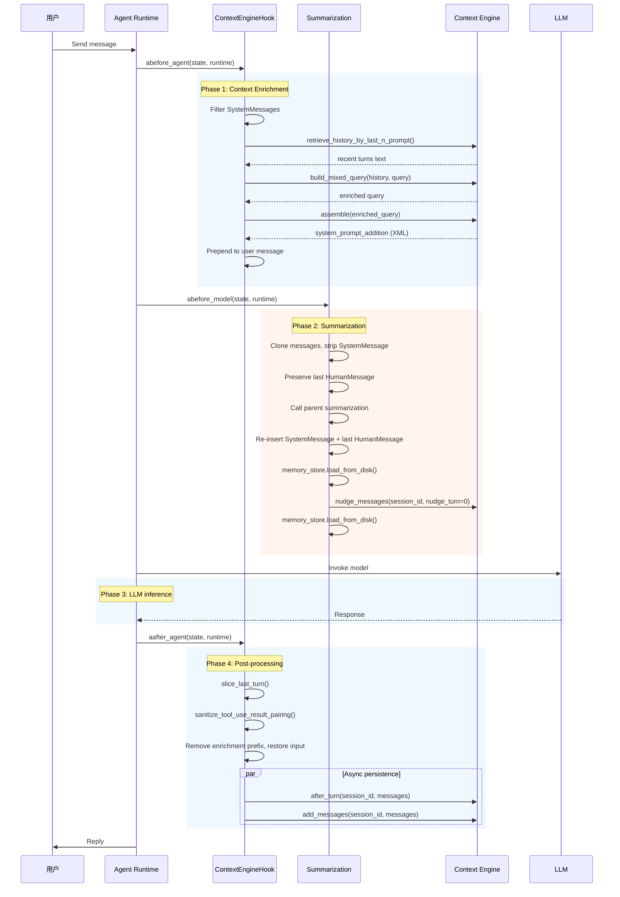

# Agent Middlewares — Agent Middleware System

[**中文文档**](README.zh.md) | **English**

> **Agent Middlewares** is the middleware layer of the EMA AI Agent, situated at key nodes of the Agent execution pipeline. They are responsible for **context enrichment**, **conversation summarization**, **memory management**, **tool call safety**, **message normalization**, and **multimodal transcoding** — executing before and after model inference via LangChain's AOP-style middleware framework.

---

## Table of Contents

- [Overview](#overview)
- [Architecture](#architecture)
- [Middleware Details](#middleware-details)
  - [ContextEngineHook](#contextenginehook)
  - [Summarization](#summarization)
  - [ToolLoopPrevention](#toolloopprevention)
  - [ToolCallNormalize](#toolcallnormalize)
  - [ToolTimeout](#tooltimeout)
  - [MultimodalProcessor](#multimodalprocessor)
- [Comparison](#comparison)
- [Workflow (Sequence Diagram)](#workflow-sequence-diagram)
- [Lifecycle](#lifecycle)
- [Core Mechanisms](#core-mechanisms)
- [Data Model](#data-model)
- [Configuration](#configuration)
- [Usage Examples](#usage-examples)
- [FAQ](#faq)
- [Tech Stack](#tech-stack)
- [License](#license)

---

## Overview

### Design Position

Agent Middlewares are built on LangChain's middleware framework (`AgentMiddleware` / `SummarizationMiddleware`). They use **Aspect-Oriented Programming (AOP)** to hook into the Agent execution pipeline, running cross-cutting logic at specific points in each inference cycle.

| Middleware | Timing | Responsibility |
|-----------|--------|---------------|
| `ContextEngineHook` | Before & after Agent inference | Retrieve skill memories from the Context Engine and construct enriched prompts; persist dialogue after inference |
| `Summarization` | Before model call | Summarize context window when conversation history grows too long; trigger user preference extraction |
| `ToolLoopPrevention` | Wrap tool call | Throttle repeated calls to the same tool within a single conversation turn; reset counter each turn |
| `ToolCallNormalize` | Before model call | Sanitize tool call/result pairs before sending to the model to prevent malformed sequences |
| `ToolTimeout` | Wrap tool call | Enforce a configurable timeout on each individual tool call via `asyncio.wait_for` |
| `MultimodalProcessor` | Before & after Agent | Save user-uploaded images/audio/video to local temp directory; strip inline `image_url` blocks from history messages |

### Core Capabilities

1. **Context Enrichment** — Before Agent inference, retrieve relevant skills and memories from the Skill Memory Graph and construct an enriched prompt
2. **Conversation Summarization** — Before model call, compress overly long context windows to prevent token overrun
3. **Preference Extraction** — Simultaneously trigger user preference extraction during summarization, writing preferences into the long-term memory store
4. **Auto-Persistence** — Automatically persist each inference turn to MesMemory via `asyncio.create_task`
5. **Tool Loop Prevention** — Limit repeated calls to the same tool within a turn, preventing runaway tool loops
6. **Tool Call Normalization** — Fix malformed tool call/result pairings before sending to the LLM
7. **Tool Timeout** — Gracefully cancel hung tool calls after a configurable timeout
8. **Multimodal Transcoding** — Decode base64 images from user input to local files, stripping inline `image_url` blocks for models that do not support them

---

## Architecture

```
Agent Execution Pipeline:

┌─────────────────────────────────────────────────────────────┐
│                    Agent Runtime (LangGraph)                 │
├─────────────────────────────────────────────────────────────┤
│                                                              │
│  ① abefore_agent()                                           │
│     └─ ContextEngineHook.abefore_agent                       │
│        ├─ Filter out SystemMessages from state["messages"]   │
│        ├─ Extract last HumanMessage content                  │
│        └─ _build_turn_prompt(query_text):                    │
│           ├─ retrieve_history_by_last_n_prompt() → turns     │
│           ├─ build_mixed_query() → enriched query            │
│           └─ assemble() → Skill Memory Graph context         │
│              └─ Prepend result as system prompt to message   │
│                                                              │
│  ② abefore_model()                                           │
│     └─ Summarization.abefore_model (extends SummarizationMW) │
│        ├─ Clone message list, strip SystemMessage            │
│        ├─ Preserve the last HumanMessage                     │
│        ├─ Call parent summarization → reduce_messages       │
│        ├─ Re-insert SystemMessage and last HumanMessage      │
│        ├─ memory_store.load_from_disk()  (before nudge)      │
│        ├─ nudge_messages(session_id, nudge_turn=0)           │
│        └─ memory_store.load_from_disk()  (after nudge)       │
│                                                              │
│  ③ LLM Inference                                             │
│                                                              │
│  ④ aafter_agent()                                            │
│     └─ ContextEngineHook.aafter_agent                        │
│        ├─ slice_last_turn() → extract last dialogue turn     │
│        ├─ sanitize_tool_use_result_pairing() → clean pairs   │
│        ├─ Remove enrichment prefix, restore original input   │
│        ├─ asyncio.create_task(after_turn())   → async learn  │
│        └─ asyncio.create_task(add_messages()) → persist      │
│                                                              │
└─────────────────────────────────────────────────────────────┘
```

### Execution Order

```
1. abefore_agent  (ContextEngineHook, MultimodalProcessor, ToolLoopPrevention)
                                      —→  Context enrichment + image decode + counter reset
2. abefore_model  (Summarization, ToolCallNormalize)
                                      —→  Context compression + preference extraction + pair sanitization
3. awrap_tool_call(ToolLoopPrevention, ToolTimeout)
                                      —→  Throttling + timeout enforcement
4. LLM Model Inference
5. aafter_agent   (ContextEngineHook, MultimodalProcessor)
                                      —→  Memory persistence + knowledge learning + temp cleanup
```

---

## Middleware Details

### ContextEngineHook

**File:** `context_engine_hook.py`

**Class:** `ContextEngineHook(AgentMiddleware)`

Enriches the user message **before** Agent inference and persists the dialogue **after** Agent inference.

#### `__init__(session_id: str)`

```python
hook = ContextEngineHook(session_id="session_001")
```

Stores the session ID and initializes an empty `_turn_prompt` string that will be populated during `abefore_agent`.

---

#### `_build_turn_prompt(query_text: str) -> None`

Internal method that constructs the enrichment prefix by orchestrating three Context Engine calls:

```python
async def _build_turn_prompt(self, query_text: str) -> None:
    # 1. Retrieve recent conversation turns
    recent_messages_addition = retrieve_history_by_last_n_prompt(session_id=self._session_id)

    # 2. Rewrite query with history context (pronouns → entities)
    transformer_query_text = build_mixed_query(
        turns_of_history=recent_messages_addition,
        query=query_text
    )

    # 3. Retrieve Skill Memory Graph context
    assemble_result = await assemble(user_text=transformer_query_text)
    skill_system_prompt_addition = assemble_result.get("system_prompt_addition", "")

    # Build structured content: context + instruction
    self._turn_prompt = textwrap.dedent(f"""\
        {skill_system_prompt_addition}\n\n
        Using the reference materials above (note: they may contain inaccuracies,
        so use them critically), answer the user's actual question below.\n\n
    """)
```

**Key details:**
- The enrichment prefix includes both Skill Memory graph context and a critical-use instruction
- The prefix is stored in `self._turn_prompt` and later removed in `aafter_agent` to prevent context window bloat

---

#### `abefore_agent(state, runtime)`

```
Input: User's original message "How to deploy Docker?"
        │
        ▼
1. Filter out SystemMessages from state["messages"] (reverse iteration, in-place delete)
2. Extract content from the last HumanMessage
3. Handle three message formats:
   ├─ Plain text str       → _build_turn_prompt() + prepend
   ├─ Single media dict    → only enrich "type":"text" portion
   └─ Multimodal list      → find text item, enrich in-place
4. Prepend self._turn_prompt to the original message

Output: "[Skill memory context + instruction] How to deploy Docker?"
```

**Message format support:**

| Input Type | Behavior |
|-----------|----------|
| `str` | Direct enrichment via string concatenation |
| `dict` (single media) | Enrich `text` key in-place |
| `list[dict]` (multimodal) | Find `type="text"` item, enrich in-place |
| Empty/None content | Return `None` (skip) |

---

#### `aafter_agent(state, runtime)`

```
Input: Full inference result message list
        │
        ▼
1. slice_last_turn(all_messages) → extract last dialogue turn
2. sanitize_tool_use_result_pairing(last_turn) → clean tool call/result pairs
3. Extract user_text from the cleaned last human message
4. Remove enrichment prefix: user_text = user_text.removeprefix(self._turn_prompt)
5. Write back the restored original user input to last_human_message.content
6. Extract AI response text from subsequent messages
7. Launch two async tasks concurrently:
   ├─ after_turn(session_id, last_turn_messages)
   │   └─ Skill Memory learning pipeline (knowledge extraction + graph update)
   └─ add_messages(session_id, messages)
       └─ Persist to MesMemory SQLite storage
   └─ await asyncio.gather(task1, task2)
```

**Key details:**

| Concern | Solution |
|---------|----------|
| Non-blocking persistence | `asyncio.create_task` + `asyncio.gather` |
| Context window management | Enrichment prefix removed before storing |
| Tool call integrity | `sanitize_tool_use_result_pairing` fixes unbalanced pairs |
| Multi-format user input | Handles `str`, `dict`, `list[dict]` same as `abefore_agent` |

---

### Summarization

**File:** `summarization.py`

**Class:** `Summarization(SummarizationMiddleware)`

Compresses overly long conversation history before model calls, and triggers user preference extraction during compression.

#### `__init__(session_id: str, **kwargs)`

```python
summarizer = Summarization(session_id="session_001", ...)
```

The `**kwargs` are forwarded to the parent `SummarizationMiddleware` (base compression configuration).

---

#### `abefore_model(state, runtime)`

```
Input: Potentially oversized message list (e.g., 100K+ tokens)
        │
        ▼
1. Copy state + message list (avoid mutating original)
2. Strip SystemMessage → save reference, delete from copy
3. Preserve the last HumanMessage → save reference
4. Call parent SummarizationMiddleware.abefore_model(copy_state, runtime)
   └─ LLM-based summarization of historical messages
   └─ Returns reduce_messages (contains RemoveMessage markers)
5. Re-insert SystemMessage after the first RemoveMessage in reduce_messages
6. If the saved last HumanMessage != the last one in reduce_messages, re-insert it
7. memory_store.load_from_disk()  — sync in-memory state with disk
8. nudge_messages(session_id, nudge_turn=0)  — force preference extraction
9. memory_store.load_from_disk()  — reload to capture nudge writes
10. Return res (the parent's result dict)
```

**Key details:**

| Concern | Solution |
|---------|----------|
| SystemMessage separation | Stripped before compression to avoid polluting semantic density |
| Latest user input preservation | Last `HumanMessage` re-inserted after compression so LLM sees the original question |
| Data consistency | `memory_store.load_from_disk()` called **before and after** nudge to sync in-memory state with disk |
| Force extraction | `nudge_turn=0` bypasses the normal turn-interval check |
| Immutable state | Messages list is cloned to avoid side effects on the original agent state |

**Why system message separation?**

System prompts (character settings, tool definitions, etc.) have a fundamentally different semantic distribution from historical conversation messages. Mixing them into the same compression pass would reduce information density — the summarizer would waste capacity encoding the (unchanging) system prompt alongside the (changing) conversation. Stripping it before compression and re-inserting after yields a significantly better summary quality.

**Why reload memory_store before and after nudge?**

`memory_store` is a singleton in-memory cache backed by markdown files on disk. It can become stale if other agents or processes have written to disk since the last load. Reloading before nudge ensures the extractor sees the latest state; reloading afterward ensures subsequent reads see the newly written preferences.

---

### ToolLoopPrevention

**File:** `tool_loop_prevention.py`

**Class:** `ToolLoopPrevention(AgentMiddleware)`

Prevents the same tool from being called more than N times within a single conversation turn, guard-railing against runaway tool-chaining loops.

#### `__init__(session_id: str, threshold: int = 20)`

```python
preventer = ToolLoopPrevention(session_id="session_001", threshold=20)
```

The `threshold` controls the maximum number of consecutive calls allowed per tool per turn.

---

#### `abefore_agent(state, runtime)`

Resets the per-turn tool call counters at the start of each new conversation turn.

```
Input: New conversation turn begins
        │
        ▼
self._turn_tool_counts.clear()
```

#### `awrap_tool_call(request, handler)`

```
Input: A tool call request
        │
        ▼
1. Increment counter for this tool name
2. If counter > threshold:
   └─ Return error ToolMessage: "Tool [name] called {count} times, exceeding limit"
   └─ status="error"
3. Else: delegate to the real handler
```

**Key details:**

| Concern | Solution |
|---------|----------|
| Counter scope | Per-turn, reset in `abefore_agent` |
| Threshold type | Per-tool, not global — each tool has its own independent counter |
| Error signaling | `ToolMessage` with `status="error"` tells the model to reconsider |

---

### ToolCallNormalize

**File:** `tool_call_normalize.py`

**Class:** `ToolCallNormalize(AgentMiddleware)`

Sanitizes tool call/result message pairs before the model sees them. Removes all existing messages and rebuilds with properly paired tool calls and results via `sanitize_tool_use_result_pairing`.

#### `__init__(session_id: str)`

```python
normalizer = ToolCallNormalize(session_id="session_001")
```

#### `abefore_model(state, runtime)`

```
Input: State with potentially unbalanced tool call/result pairs
        │
        ▼
1. Remove ALL existing messages via RemoveMessage(id=REMOVE_ALL_MESSAGES)
2. Rebuild with sanitize_tool_use_result_pairing(state["messages"])
3. Return the normalized message list
```

**Key details:**

| Concern | Solution |
|---------|----------|
| Pair repair | `sanitize_tool_use_result_pairing` re-aligns orphan calls with their results |
| Clean slate | `REMOVE_ALL_MESSAGES` ensures no stale messages survive the rewrite |
| Timing | Runs `abefore_model` — before every LLM inference, not just on compression |

---

### ToolTimeout

**File:** `tool_timeout.py`

**Class:** `ToolTimeout(AgentMiddleware)`

Wraps every tool invocation with `asyncio.wait_for` so that a hung tool call is cancelled after a configurable timeout and an error `ToolMessage` is returned to the model instead of blocking the agent forever.

#### `__init__(session_id: str, timeout_seconds: float | None = None)`

```python
timeout_mw = ToolTimeout(session_id="session_001", timeout_seconds=120.0)
```

If `timeout_seconds` is `None`, the value is read from the `TOOL_CALL_TIMEOUT_MINUTES` environment variable (set in `.env`). A value of `0.0` disables the timeout.

---

#### `awrap_tool_call(request, handler)`

```
Input: A tool call request
        │
        ▼
1. If timeout <= 0.0: pass through to real handler immediately
2. Otherwise:
   └─ asyncio.wait_for(handler(request), timeout=timeout_seconds)
3. On TimeoutError:
   └─ Log warning: "Tool [name] timed out after {timeout} seconds"
   └─ Return error ToolMessage with status="error"
```

**Key details:**

| Concern | Solution |
|---------|----------|
| Timeout source | `TOOL_CALL_TIMEOUT_MINUTES` from `.env`, or explicit `timeout_seconds` constructor arg |
| Graceful failure | Returns `ToolMessage` with `status="error"` so the model can try a different approach |
| Zero = disabled | Explicitly checks `timeout <= 0.0` to bypass wrapping entirely |

---

### MultimodalProcessor

**File:** `multimodal_processor.py`

**Class:** `MultimodalProcessor(AgentMiddleware)`

Transcodes multimodal user input (base64-encoded images) into local temp files before Agent inference, and strips stale cached images after inference. It also strips `image_url` blocks from history messages for models (like DeepSeek) that do not support inline image URLs.

#### `__init__(session_id: str)`

```python
processor = MultimodalProcessor(session_id="session_001")
```

---

#### `abefore_agent(state, runtime)`

```
Input: State with multimodal user message (image_url, etc.)
        │
        ▼
1. Check last message is HumanMessage with list content
2. Iterate content items:
   ├─ "type":"text"       → save reference (at most one allowed)
   ├─ "type":"image_url"  → decode base64 → save to SRC_DIR/mutil_temp/{timestamp}.png
   └─ (audio/video stubs) → collect paths for future handling
3. Append system hint to text: "[System: The user uploaded N images. Location: ...]"
4. Replace message content with text-only dict
5. Strip image_url blocks from ALL history HumanMessages (in-place)
```

**Output:** User message content becomes a plain text dict; images are saved as local `.png` files.

---

#### `aafter_agent(state, runtime)`

Cleans up expired cached images from the temp directory:

```
Input: After inference completes
        │
        ▼
1. If SRC_DIR/mutil_temp/ does not exist → return
2. For each file:
   ├─ If filename is NOT a pure numeric timestamp → delete immediately (tampered)
   └─ If file age > 7 days → delete
3. Log cleanup count
```

**Key details:**

| Concern | Solution |
|---------|----------|
| Image persistence | Decoded to `SRC_DIR/mutil_temp/{timestamp_ms}.png` before inference |
| Model compatibility | Strips `image_url` blocks from history — required by DeepSeek and similar models |
| Temp file cleanup | `aafter_agent` deletes files older than 7 days; non-timestamp filenames removed unconditionally |
| Audio/Video stubs | `TODO` markers in code for future speech-to-text and video-to-text processing |
| Single text constraint | Raises `Exception` if more than one `type="text"` item is present in the input |

---

## Comparison

| Feature | ContextEngineHook | Summarization | ToolLoopPrevention | ToolCallNormalize | ToolTimeout | MultimodalProcessor |
|---------|-------------------|---------------|--------------------|-------------------|-------------|---------------------|
| **Base Class** | `AgentMiddleware` | `SummarizationMiddleware` | `AgentMiddleware` | `AgentMiddleware` | `AgentMiddleware` | `AgentMiddleware` |
| **Timing** | Before & after Agent | Before model call | Wrap tool call | Before model call | Wrap tool call | Before & after Agent |
| **Core Operation** | Context enrichment + persistence | Summarization + preference extraction | Throttle repeated tool calls | Sanitize tool call/result pairs | Enforce timeout on tool calls | Decode images, strip image_url blocks |
| **Blocking** | Async non-blocking (after part) | Sync blocking | Sync blocking | Sync blocking | Async with timeout | Sync blocking |
| **Dependencies** | Context Engine (`assemble`, `after_turn`, `add_messages`) | MesMemory (`nudge_messages`), `memory_store` | None | `pub_func.sanitize_tool_use_result_pairing` | `TOOL_CALL_TIMEOUT_MINUTES` env var | `PIL` (Pillow), `SRC_DIR` config |
| **Frequency** | Every Agent inference turn | Only when context is too long (parent decides) | Every tool call | Every model inference | Every tool call | Every turn with multimodal input |
| **Message Mutation** | In-place (enrich + restore) | Clone + modify copy | Returns error `ToolMessage` | Full message list rewrite | Returns error `ToolMessage` | In-place content rewrite |

---

## Workflow (Sequence Diagram)



---

## Lifecycle

| Phase | ContextEngineHook | Summarization | ToolLoopPrevention | ToolCallNormalize | ToolTimeout | MultimodalProcessor |
|-------|-------------------|---------------|--------------------|-------------------|-------------|---------------------|
| **Before Agent** | Strip system messages → extract query → build enrichment via Context Engine → prepend to user message | — | Reset per-turn tool call counters | — | — | Decode base64 images to temp files; strip `image_url` blocks from history |
| **Before Model** | — | Clone state → strip system → preserve last human → call parent compression → re-insert system + human → reload memory_store → nudge → reload memory_store | — | Remove all messages → rebuild with `sanitize_tool_use_result_pairing` | — | — |
| **Wrap Tool Call** | — | — | Increment tool counter → reject if exceeding threshold | — | Wrap with `asyncio.wait_for` → return error on timeout | — |
| **LLM Inference** | — | — | — | — | — | — |
| **After Agent** | Extract last turn → clean tool pairs → restore original input → `after_turn()` (async skill learn) → `add_messages()` (async persist) | — | — | — | — | Cleanup stale temp images (>7 days) |

---

## Core Mechanisms

### 1. AOP-based Middleware Hook

Both middlewares use LangChain's AOP-style middleware framework. `ContextEngineHook` extends `AgentMiddleware` to hook into the Agent lifecycle (`abefore_agent` / `aafter_agent`). `Summarization` extends `SummarizationMiddleware` to hook into the model lifecycle (`abefore_model`).

This design allows cross-cutting concerns (memory, compression) to be cleanly separated from the core Agent logic without modifying the Agent itself.

### 2. Three-format Message Support

The `ContextEngineHook` handles three distinct message content formats transparently:

| Format | Example | Enrichment Strategy |
|--------|---------|-------------------|
| `str` | `"How to deploy?"` | String concatenation |
| `dict` | `{"type": "text", "text": "Hello"}` | In-place `text` key modification |
| `list[dict]` | `[{"type": "text", ...}, {"type": "image_url", ...}]` | Find text item, enrich in-place |

This ensures compatibility with both text-only and multimodal workflows.

### 3. Enrichment Prefix Lifecycle

The enrichment prefix is injected in `abefore_agent` and stripped in `aafter_agent`:

```
Injection (abefore_agent):
  "[Skill context + instruction] How to deploy Docker?"
                                                       ↑ enrichment
Removal (aafter_agent):
  user_text.removeprefix(self._turn_prompt)
  → "How to deploy Docker?"   ← original restored
```

This prevents the enrichment prefix from accumulating in MesMemory across turns, which would otherwise rapidly consume the context window.

### 4. Force Nudge on Compression

Summarization forces preference extraction during compression via `nudge_turn=0`. This is a deliberate trade-off:

- **Without force**: Preferences embedded in old conversation turns would be lost when those turns are compressed into a summary
- **With force**: Latent preferences (e.g., "I prefer terse answers") are extracted and persisted before the original messages are replaced by a summary

### 5. Async Non-blocking Post-processing

`ContextEngineHook.aafter_agent` launches `after_turn()` and `add_messages()` as concurrent `asyncio.create_task` calls, gathered via `asyncio.gather`. This ensures:

- The Agent's response latency is not affected by persistence or knowledge extraction
- Both tasks run concurrently (extraction and persistence in parallel)
- If either task fails, the exception propagates through `asyncio.gather` (no silent swallowing)

### 6. Per-Turn Tool Loop Detection

`ToolLoopPrevention` resets its counters at the start of every turn (`abefore_agent`) and intercepts tool calls via `awrap_tool_call`. Each tool name has its own independent counter — calling ToolA 40 times does not affect ToolB's counter. When the threshold is exceeded, the model receives an error `ToolMessage` and can choose a different approach.

### 7. Full Message List Rewrite

`ToolCallNormalize` uses `RemoveMessage(id=REMOVE_ALL_MESSAGES)` to clear the entire message list before rebuilding it via `sanitize_tool_use_result_pairing`. This is an intentional nuclear approach — rather than trying to preserve and fix individual malformed pairs, it starts from a clean slate and reconstructs only well-formed pairs.

### 8. Graceful Tool Timeout

`ToolTimeout` wraps every tool call in `asyncio.wait_for`, returning a structured `ToolMessage` error on timeout instead of crashing the agent. The timeout is configurable at construction or via `TOOL_CALL_TIMEOUT_MINUTES` in `.env`. A value of `0` fully disables timeout wrapping.

### 9. Inline Multimodal Transcoding

`MultimodalProcessor` decodes base64-encoded images from user messages into local PNG files before Agent inference, and strips the `image_url` blocks from the message history. This is necessary for models (e.g., DeepSeek) that do not support inline image URLs. The temp directory is periodically cleaned by `aafter_agent`, removing files older than 7 days.

---

## Data Model

### State Message Types

```python
from langchain_core.messages import BaseMessage, SystemMessage, HumanMessage, AIMessage, RemoveMessage
```

| Type | Role in Middleware |
|------|-------------------|
| `SystemMessage` | Stripped before enrichment (ContextEngineHook) and before compression (Summarization) to prevent pollution |
| `HumanMessage` | Source of user query for enrichment; last one preserved during compression |
| `AIMessage` | Source of AI response extracted in `aafter_agent` |
| `RemoveMessage` | Marker inserted by parent `SummarizationMiddleware` to mark messages for removal |

### ContextEnrichment State

```
self._turn_prompt: str
  └─ Enrichment prefix built during abefore_agent
  └─ Format: [skill_memory_context] + instruction_text
  └─ Used in: abefore_agent (prepend) → aafter_agent (removeprefix)
```

### Memory Store State

`memory_store` is a singleton module-level object (`from tools import memory_store`) managed by the `Summarization` middleware:

- **Type**: In-memory cache backed by markdown files on disk
- **Read**: `memory_store.load_from_disk()` — synchronizes in-memory state with disk
- **Write**: `nudge_messages()` — writes extracted preferences to markdown files
- **Consistency**: Loaded before and after nudge to prevent stale reads

---

## Configuration

| Config | ContextEngineHook | Summarization | ToolLoopPrevention | ToolCallNormalize | ToolTimeout | MultimodalProcessor |
|--------|-------------------|---------------|--------------------|-------------------|-------------|---------------------|
| **Session ID** | `session_id` (constructor) | `session_id` (constructor) | `session_id` (constructor) | `session_id` (constructor) | `session_id` (constructor) | `session_id` (constructor) |
| **Threshold / Timeout** | — | — | `threshold` (default 20) | — | `timeout_seconds` or `TOOL_CALL_TIMEOUT_MINUTES` env var | — |
| **History turns** | N/A (delegates to `retrieve_history_by_last_n_prompt()` — default 5) | — | — | — | — | — |
| **Nudge force** | — | `nudge_turn=0` (always forces extraction) | — | — | — | — |
| **Message format support** | `str`, `dict`, `list[dict]` | `list[BaseMessage]` (standard LangGraph format) | ToolMessage | list[BaseMessage] | ToolMessage | `list[dict]` (multimodal) |
| **Parent config** | — | Forwarded via `**kwargs` to `SummarizationMiddleware` | — | — | — | — |

---

## Usage Examples

### Registering Middlewares

```python
from agent.middlewares import (
    ContextEngineHook,
    Summarization,
    ToolLoopPrevention,
    ToolCallNormalize,
    ToolTimeout,
    MultimodalProcessor
)

# Create middleware instances
context_hook = ContextEngineHook(session_id="session_001")
summarizer = Summarization(session_id="session_001")
loop_prevent = ToolLoopPrevention(session_id="session_001", threshold=20)
normalizer = ToolCallNormalize(session_id="session_001")
timeout_mw = ToolTimeout(session_id="session_001", timeout_seconds=120.0)
mm_processor = MultimodalProcessor(session_id="session_001")

# Register with LangGraph Runtime
# The Runtime accepts middleware during construction or via add_middleware
runtime = Runtime(
    agent=my_agent,
    middlewares=[context_hook, summarizer, loop_prevent, normalizer, timeout_mw, mm_processor]
    # Execution order:
    #   abefore_agent:  ContextEngineHook → MultimodalProcessor → ToolLoopPrevention
    #   abefore_model:  Summarization → ToolCallNormalize
    #   awrap_tool_call: ToolLoopPrevention → ToolTimeout
    #   LLM Inference
    #   aafter_agent:   ContextEngineHook → MultimodalProcessor
)
```

### Standalone ContextEngineHook Usage

```python
from agent.middlewares import ContextEngineHook

hook = ContextEngineHook(session_id="session_001")

# Usually called by LangGraph Runtime, but can be invoked directly for testing:
await hook.abefore_agent(state, runtime)
# → state["messages"][-1].content is now enriched

# ... after LLM inference ...
await hook.aafter_agent(state, runtime)
# → dialogue persisted to MesMemory, Skill Memory updated
```

### Standalone Summarization Usage

```python
from agent.middlewares import Summarization
from langgraph.runtime import Runtime

summarizer = Summarization(
    session_id="session_001",
    # Additional SummarizationMiddleware kwargs go here
)

# Called by LangGraph Runtime before model inference:
await summarizer.abefore_model(state, runtime)
# → Long context compressed, preferences extracted
```

### Standalone ToolLoopPrevention Usage

```python
from agent.middlewares import ToolLoopPrevention

preventer = ToolLoopPrevention(session_id="session_001", threshold=5)

# Reset counters at turn start:
await preventer.abefore_agent(state, runtime)

# Wrap tool calls:
result = await preventer.awrap_tool_call(request, handler)
# → If tool called >5 times in this turn, returns error ToolMessage
```

### Standalone ToolTimeout Usage

```python
from agent.middlewares import ToolTimeout

timeout_mw = ToolTimeout(session_id="session_001", timeout_seconds=30.0)

# Wrap tool calls with timeout:
result = await timeout_mw.awrap_tool_call(request, handler)
# → If tool takes >30s, returns error ToolMessage with status="error"
```

### Standalone MultimodalProcessor Usage

```python
from agent.middlewares import MultimodalProcessor

processor = MultimodalProcessor(session_id="session_001")

# Decode images before inference:
await processor.abefore_agent(state, runtime)
# → base64 images decoded to SRC_DIR/mutil_temp/{timestamp}.png
# → image_url blocks stripped from history

# ... after LLM inference ...
await processor.aafter_agent(state, runtime)
# → stale temp files >7 days cleaned up
```

---

## FAQ

### Q1: Why does ContextEngineHook filter out SystemMessages?

In `abefore_agent`, SystemMessages are filtered out to prevent system prompts (character settings, tool definitions, etc.) from being passed as query context to the Context Engine. This ensures Skill Memory and long-term memory retrieval accuracy. The `system_prompt_addition` is returned separately via the enrichment prefix.

### Q2: Why does Summarization force preference extraction during compression?

Compression means the context window is shrinking, and old conversation history will be replaced by summaries. If preferences are not extracted at this moment, details (like explicitly stated user preferences) are permanently lost. Forcing extraction ensures preferences are persisted to the long-term memory store even after the original conversation is summarized.

### Q3: What are the risks of using `asyncio.create_task` in `aafter_agent`?

`after_turn` and `add_messages` run asynchronously via `asyncio.create_task` and are gathered with `asyncio.gather`. Unlike raw `create_task` (which can silently swallow exceptions), `gather` propagates exceptions. However:
- If the Agent process exits abnormally between `create_task` and `gather`, incomplete tasks may still be lost
- The `gather` ensures both tasks complete before `aafter_agent` finishes — so exception handling is covered
- This is an accepted trade-off: post-processing reliability is bounded by the async event loop lifecycle

### Q4: How is middleware execution order guaranteed?

The execution order is governed by the middleware chain inside LangGraph's Runtime. The ordering is:
1. `abefore_agent` → `abefore_model` → LLM → `aafter_agent`
2. Multiple middlewares in the same phase execute in registration order

### Q5: What happens if `_build_turn_prompt` fails?

If `_build_turn_prompt` throws an exception (e.g., Context Engine unavailable), `abefore_agent` will propagate the error upward to the LangGraph Runtime. The middleware framework does not catch exceptions by default — if enrichment is critical, the caller should handle the error at the runtime level.

### Q6: Why clone the message list in Summarization?

The Summarization middleware clones the messages list before modifying it to avoid side effects on the original `state["messages"]`. This is important because:
- The parent `SummarizationMiddleware.abefore_model` expects a mutable copy it can freely modify
- The original state should remain untouched until the runtime officially applies middleware results
- Cloning prevents bugs where downstream handlers see partially-modified state

### Q7: What happens to multimodal content during enrichment?

For `list[dict]` (multimodal) messages, only the `type="text"` portion is enriched. Images and other media items pass through unchanged. The enrichment is written back in-place into the same text item, preserving the original message structure.

### Q8: When should I use `ToolLoopPrevention` vs `ToolTimeout`?

They solve different problems:
- **ToolLoopPrevention** guards against runaway *call sequencing* — the model repeatedly calling the same tool in a single turn (e.g., calling `web_search` in a loop 50 times to page through results). It limits the *number* of calls.
- **ToolTimeout** guards against a *single hung call* — a tool that never returns (e.g., a web search that hangs on a slow endpoint). It limits the *duration* of each call.

They are complementary: you usually want both.

### Q9: Why does `ToolCallNormalize` remove ALL messages instead of fixing only broken pairs?

Because detecting malformed pairs is inherently fragile — a pair may appear well-formed to simple heuristics while being semantically broken (e.g., a tool result added after the agent has already started generating a new response). By rebuilding from scratch with `sanitize_tool_use_result_pairing`, the normalizer guarantees a globally consistent message list. The performance cost is negligible since this operates on in-memory message lists.

### Q10: What happens if `MultimodalProcessor` encounters an unsupported media type?

Audio and video content types have `TODO` stubs in the code — the processor recognizes them and collects their paths into internal tracking variables, but does not yet decode them. The text is still preserved, and images are processed normally. The stubs are placeholders for future speech-to-text and video-to-text pipeline integration.

---

## Tech Stack

| Component | Technology |
|-----------|-----------|
| **Middleware Framework** | LangChain `AgentMiddleware` / `SummarizationMiddleware` |
| **Agent Runtime** | LangGraph `Runtime` |
| **Message Model** | LangChain `BaseMessage` / `SystemMessage` / `HumanMessage` / `AIMessage` / `RemoveMessage` |
| **Memory System** | Context Engine (Skill Memory Graph + MesMemory) |
| **Storage (MesMemory)** | SQLite + FTS5 |
| **Storage (Memory Store)** | Markdown files (`.md`) on disk, loaded into in-memory singleton |
| **Async Framework** | `asyncio.create_task` + `asyncio.gather` |
| **Utility** | `textwrap.dedent` (enrichment prompt formatting) |
| **External Helpers** | `pub_func.slice_last_turn`, `pub_func.sanitize_tool_use_result_pairing` |
| **Image Processing** | PIL (Pillow) — base64 decode + file write |
| **Tool Call Safety** | Custom `awrap_tool_call` wrapping for throttle + timeout |
| **Message Normalization** | `sanitize_tool_use_result_pairing` (full list rewrite) |
| **Configuration** | `.env` (`TOOL_CALL_TIMEOUT_MINUTES`), constructor arguments |
| **Temp File Management** | `SRC_DIR/mutil_temp/` with 7-day TTL cleanup |

---

## License

This project is licensed under the MIT License (following the EMA AI Agent license).

---

**Author:** MOYE  
**Last updated:** 2026-06-02
