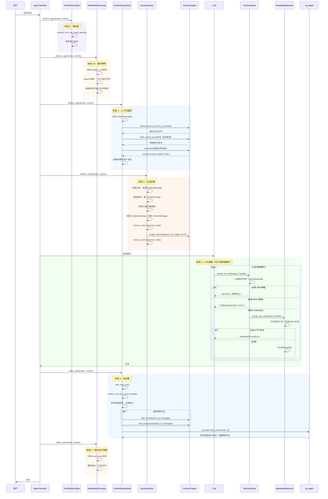

# Agent Middlewares — Agent 中间件系统

**中文** | [**English**](README.md)

> **Agent Middlewares** 是 EMA AI Agent 的中间件层，位于 Agent 核心执行流程的关键节点，通过 LangChain 的 AOP 风格中间件框架，在模型推理的**前、中、后**阶段负责**上下文增强**、**对话压缩**、**记忆管理**、**工具调用安全**、**消息标准化**、**心跳监控**和**多模态转码**。

---

## 目录

- [概述](#概述)
- [架构](#架构)
- [中间件详解](#中间件详解)
  - [ContextEngineHook](#contextenginehook)
  - [Summarization](#summarization)
  - [ToolGuardrails](#toolguardrails)
  - [ToolCallNormalize](#toolcallnormalize)
  - [IterationBudget](#iterationbudget)
  - [HeartbeatStaleness](#heartbeatstaleness)
  - [MultimodalProcessor](#multimodalprocessor)
- [对比](#对比)
- [工作流（时序图）](#工作流时序图)
- [生命周期](#生命周期)
- [核心机制](#核心机制)
- [数据模型](#数据模型)
- [配置](#配置)
- [使用示例](#使用示例)
- [FAQ](#faq)
- [技术栈](#技术栈)
- [许可证](#许可证)

---

## 概述

### 设计定位

Agent Middlewares 基于 LangChain 的中间件体系（`AgentMiddleware` / `SummarizationMiddleware`）实现，通过**切面编程（AOP）**的方式挂载到 Agent 执行流水线中，在每个推理周期的特定时机执行横切逻辑。

| 中间件 | 时机 | 职责 |
|--------|------|------|
| `Summarization` | 模型调用前 | 对话历史过长时压缩上下文窗口，触发用户偏好提取 |
| `ToolCallNormalize` | Agent 推理前 | 修复工具调用/结果配对不一致、缺少参数等问题 |
| `ToolGuardrails` | 每次工具调用前 (via `awrap_tool_call`) | 三级防护：warn/block/halt，检测并阻止工具调用循环 |
| `IterationBudget` | 工具返回后 | 限制每轮 LLM-工具迭代次数上限，超出后强制生成最终答案 |
| `HeartbeatStaleness` | Agent 推理前后 + 每次工具/模型调用 | 监控 Worker Agent 心跳，检测无进展后终止（仅 Worker Agent 使用） |
| `MultimodalProcessor` | Agent 推理前 & 推理后 | 将 base64 图片解码为临时文件供模型消费；推理后清理过期临时文件 |
| `ContextEngineHook` | Agent 推理前 & 推理后 | 从 Context Engine 检索技能记忆和长期记忆，构造增强提示词；推理完成后持久化对话 + 知识图谱维护 |

### 核心能力

1. **上下文增强** — 在 Agent 推理前，从 Skill Memory Graph 检索相关技能和记忆，构造增强 prompt
2. **对话压缩** — 在模型调用前压缩超长上下文窗口，防止 token 超限
3. **偏好提取** — 在压缩时同步触发用户偏好提取，将偏好写入长期 memory store
4. **自动持久化** — 每轮推理结束后通过 `asyncio.create_task` 自动将对话写入 MesMemory
5. **工具循环防护** — 自动检测并阻止同一工具在单轮内被反复调用
6. **工具调用标准化** — 修复工具调用/结果配对不一致，清理孤立消息
7. **心跳超时监控** — 定期检测 Worker Agent 是否有进展，无进展时自动终止，防止僵尸 Agent 占用资源
8. **知识图谱维护** — 每轮推理后调用 `xp_graph.after_turn()` 进行知识图谱的周期性维护
9. **多模态图片处理** — 将 base64 编码的图片解码为临时文件，推理后自动清理

---

## 架构

```
Agent 执行流水线：

┌─────────────────────────────────────────────────────────────┐
│                    Agent Runtime (LangGraph)                 │
├─────────────────────────────────────────────────────────────┤
│                                                              │
│  ① abefore_agent()                                           │
│     ├─ ContextEngineHook.abefore_agent                       │
│     │  ├─ 从 state["messages"] 中过滤 SystemMessage          │
│     │  ├─ 提取最后一条 HumanMessage 内容                     │
│     │  └─ _build_turn_prompt(query_text):                    │
│     │     ├─ retrieve_history_by_last_n_prompt() → 对话轮次  │
│     │     ├─ build_mixed_query() → 增强后的查询              │
│     │     └─ assemble() → Skill Memory Graph 上下文          │
│     │        └─ 结果作为系统提示拼接到用户消息前              │
│     ├─ ToolCallNormalize.abefore_agent                       │
│     │  └─ sanitize_tool_use_result_pairing() → 修复消息配对  │
│     ├─ HeartbeatStaleness.abefore_agent（仅 Worker Agent）    │
│     │  └─ 重置计数器，启动心跳定时器                         │
│     └─ MultimodalProcessor.abefore_agent                     │
│        └─ base64 图片解码 → 写入临时文件 → 替换消息内容      │
│                                                              │
│  ② abefore_model()                                           │
│     └─ Summarization.abefore_model (继承 SummarizationMW)    │
│        ├─ 复制消息列表，剥离 SystemMessage                    │
│        ├─ 保留最后一条 HumanMessage                           │
│        ├─ 调用父类压缩逻辑 → reduce_messages                 │
│        ├─ 重新插入 SystemMessage 和最后一条 HumanMessage      │
│        ├─ memory_store.load_from_disk()  (nudge 前)           │
│        ├─ nudge_memory(session_id, nudge_turn=0)           │
│        └─ memory_store.load_from_disk()  (nudge 后)           │
│                                                              │
│  ③ LLM 推理                                                  │
│     ├─ awrap_tool_call(request, handler) → ToolGuardrails     │
│     ├─ awrap_tool_call(request, handler) → HeartbeatStaleness │
│     │  └─ 跟踪当前工具，若已 killed 则抛 HeartbeatTimeoutError│
│     └─ (工具调用在 agent 推理循环中执行)                      │
│                                                              │
│  ④ aafter_agent()                                            │
│     ├─ ContextEngineHook.aafter_agent                        │
│     │  ├─ slice_last_turn() → 提取最后一轮对话               │
│     │  ├─ sanitize_tool_use_result_pairing() → 清理工具配对  │
│     │  ├─ 去除增强前缀，还原原始用户输入                      │
│     │  ├─ asyncio.create_task(after_turn())   → 异步学习     │
│     │  ├─ asyncio.create_task(add_messages()) → 持久化       │
│     │  └─ xp_graph.after_turn(session_id)    → 知识图谱维护  │
│     ├─ HeartbeatStaleness.aafter_agent（仅 Worker Agent）     │
│     │  └─ 停止心跳定时器                                     │
│     └─ MultimodalProcessor.aafter_agent                      │
│        └─ 清理超过 7 天的临时文件                              │
│                                                              │
└─────────────────────────────────────────────────────────────┘
```

### 执行顺序

```
1. abefore_agent
   ├─ ToolCallNormalize     —→  修复工具调用/结果配对
   ├─ MultimodalProcessor   —→  base64 图片解码为临时文件
   └─ ContextEngineHook     —→  上下文增强
2. abefore_model
   └─ Summarization         —→  上下文压缩 + 偏好提取
3. LLM 模型调用
   ├─ awrap_tool_call(ToolGuardrails)   —→  循环检测（每次调用）
   ├─ awrap_tool_call(HeartbeatStaleness) —→  心跳超时检查（每次调用）
   └─ awrap_after_tool(IterationBudget) —→  迭代计数（每次工具返回）
4. aafter_agent
   ├─ ContextEngineHook     —→  记忆持久化 + 知识学习 + 知识图谱维护
   ├─ HeartbeatStaleness    —→  停止心跳（仅 Worker Agent）
   └─ MultimodalProcessor   —→  清理过期临时文件
```

---

## 中间件详解

### ContextEngineHook

**文件：** `context_engine/core.py`

**类：** `ContextEngineHook(AgentMiddleware)`

在 Agent 推理**之前**增强用户消息，在 Agent 推理**之后**持久化对话并维护知识图谱。

#### `__init__(session_id: str)`

```python
hook = ContextEngineHook(session_id="session_001")
```

存储会话 ID 并初始化一个空的 `_turn_prompt` 字符串，该字符串将在 `abefore_agent` 期间被填充。

---

#### `_build_turn_prompt(query_text: str) -> None`

内部方法，通过编排三个 Context Engine 调用来构造增强前缀：

```python
async def _build_turn_prompt(self, query_text: str) -> None:
    # 1. 检索最近的对话轮次
    recent_messages_addition = retrieve_history_by_last_n_prompt(session_id=self._session_id)

    # 2. 基于历史重写查询（代词 → 实体）
    transformer_query_text = build_mixed_query(
        turns_of_history=recent_messages_addition,
        query=query_text
    )

    # 3. 检索 Skill Memory Graph 上下文
    assemble_result = await assemble(user_text=transformer_query_text)
    skill_system_prompt_addition = assemble_result.get("system_prompt_addition", "")

    # 构造结构化内容：上下文 + 指令
    self._turn_prompt = textwrap.dedent(f"""\
        {skill_system_prompt_addition}\n\n
        Using the reference materials above (note: they may contain inaccuracies,
        so use them critically), answer the user's actual question below.\n\n
    """)
```

**关键细节：**
- 增强前缀既包含 Skill Memory 图上下文，也包含一条批判性使用指令
- 前缀存储在 `self._turn_prompt` 中，稍后在 `aafter_agent` 中移除，防止上下文窗口膨胀

---

#### `abefore_agent(state, runtime)`

```
输入：用户原始消息 "如何部署 Docker？"
        │
        ▼
1. 从 state["messages"] 中过滤 SystemMessage（反向迭代，原地删除）
2. 提取最后一条 HumanMessage 的内容
3. 处理三种消息格式：
   ├─ 纯文本 str       → _build_turn_prompt() + 前置拼接
   ├─ 单媒体 dict      → 仅增强 "type":"text" 部分
   └─ 多媒体 list      → 找到文本项，原地增强
4. 将 self._turn_prompt 前置拼接到原始消息

输出："[技能记忆上下文 + 指令] 如何部署 Docker？"
```

**消息格式支持：**

| 输入类型 | 行为 |
|----------|------|
| `str` | 直接通过字符串拼接增强 |
| `dict`（单媒体） | 原地增强 `text` 键 |
| `list[dict]`（多媒体） | 找到 `type="text"` 项，原地增强 |
| 空/None 内容 | 返回 `None`（跳过） |

---

#### `aafter_agent(state, runtime)`

```
输入：完整的推理结果消息列表
        │
        ▼
1. slice_last_turn(all_messages) → 提取最后一轮对话
2. sanitize_tool_use_result_pairing(last_turn) → 清理工具调用/结果配对
3. 从清理后的最后一条人类消息中提取 user_text
4. 去除增强前缀：user_text = user_text.removeprefix(self._turn_prompt)
5. 将还原后的原始用户输入写回 last_human_message.content
6. 从后续消息中提取 AI 回复文本
7. 并发启动两个异步任务：
   ├─ after_turn(session_id, last_turn_messages)
   │   └─ Skill Memory 学习流水线（知识提取 + 图谱更新）
   └─ add_messages(session_id, messages)
       └─ 持久化到 MesMemory SQLite 存储
   └─ await asyncio.gather(task1, task2)
8. xp_graph.after_turn(session_id) → 知识图谱周期性维护
   └─ 包括修剪过时节点、更新边权重等
   └─ 失败时仅 debug 级别日志，不影响 Agent 流程
```

**关键细节：**

| 关注点 | 解决方案 |
|--------|----------|
| 非阻塞持久化 | `asyncio.create_task` + `asyncio.gather` |
| 上下文窗口管理 | 存储前去除增强前缀 |
| 工具调用完整性 | `sanitize_tool_use_result_pairing` 修复不均衡配对 |
| 多格式用户输入 | 与 `abefore_agent` 同理处理 `str`、`dict`、`list[dict]` |
| 知识图谱维护 | `xp_graph.after_turn()` 在 nudge 后调用，try/except 包裹 |

---

### Summarization

**文件：** `summarization.py`

**类：** `Summarization(SummarizationMiddleware)`

在模型调用前压缩过长的对话历史，并在压缩时触发用户偏好提取。

#### `__init__(session_id: str, **kwargs)`

```python
summarizer = Summarization(session_id="session_001", ...)
```

`**kwargs` 转发给父类 `SummarizationMiddleware`（基础的压缩配置）。

---

#### `abefore_model(state, runtime)`

```
输入：可能超长的消息列表（如 100K+ token）
        │
        ▼
1. 复制状态 + 消息列表（避免修改原始）
2. 剥离 SystemMessage → 保存引用，从副本中删除
3. 保留最后一条 HumanMessage → 保存引用
4. 调用父类 SummarizationMiddleware.abefore_model(copy_state, runtime)
   └─ 对历史消息进行 LLM 摘要压缩
   └─ 返回 reduce_messages（包含 RemoveMessage 标记）
5. 在 reduce_messages 中的第一个 RemoveMessage 之后重新插入 SystemMessage
6. 如果保存的最后一条 HumanMessage != reduce_messages 中的最后一条，重新插入
7. memory_store.load_from_disk()  — 同步内存状态与磁盘
8. nudge_memory(session_id, nudge_turn=0)  — 强制偏好提取
9. memory_store.load_from_disk()  — 重新加载以捕获 nudge 写入
10. 返回 res（父类的结果字典）
```

**关键细节：**

| 关注点 | 解决方案 |
|--------|----------|
| SystemMessage 分离 | 压缩前剥离，避免污染语义密度 |
| 最新用户输入保留 | 压缩后重新插入最后一条 `HumanMessage`，确保 LLM 看到原始问题 |
| 数据一致性 | `memory_store.load_from_disk()` 在 nudge **前**和**后**各调用一次，确保内存状态与磁盘同步 |
| 强制提取 | `nudge_turn=0` 绕过正常的轮次间隔检查 |
| 不可变状态 | 消息列表被克隆，避免对原始 agent 状态的副作用 |

**为什么要分离 SystemMessage？**

系统提示（角色设定、工具定义等）与历史对话消息的语义分布有本质差异。将它们混入同一压缩过程会降低信息密度 — 摘要器会浪费容量，把（不变的系统提示）和（变化的对话）一起编码。压缩前剥离、压缩后重新插入，能显著提升摘要质量。

**为什么在 nudge 前后重载 memory_store？**

`memory_store` 是一个单例内存缓存，底层由磁盘上的 markdown 文件支持。如果其他 agent 或进程在上次加载后写入过磁盘，它可能已过时。nudge 前重载确保提取器看到最新状态；nudge 后重载确保后续读取能看到新写入的偏好。

---

### ToolGuardrails

**文件：** `tool_guardrails.py`

**类：** `ToolGuardrails(AgentMiddleware)`

**配置：** `ToolCallGuardrailConfig`

三级递进式防护机制（warn → block → halt），检测并阻止同一工具在单轮 Agent 推理中被反复调用的循环行为。

#### `__init__(config: ToolCallGuardrailConfig | dict | None = None)`

```python
from agent.middlewares import ToolGuardrails, ToolCallGuardrailConfig

config = ToolCallGuardrailConfig(
    warn_threshold=3,     # 第 3 次重复：警告
    block_threshold=6,    # 第 6 次重复：阻止
    halt_threshold=9,     # 第 9 次重复：终止
    match_args=True,      # 同时匹配参数（更严格）
)
guardrails = ToolGuardrails(config=config)
```

- `warn_threshold`：同一工具调用重复指定次数后注入警告 SystemMessage（默认 3）
- `block_threshold`：同一工具调用+参数组合重复指定次数后阻止执行（默认 6）
- `halt_threshold`：阻止后仍持续生成达到指定次数后强制终止轮次（默认 9）
- `match_args`：是否同时匹配工具参数（默认 True）

---

#### `abefore_agent(state, runtime)`

重置当前轮的调用计数器。

```
输入：任何状态
        │
        ▼
1. 重置 self._count = {}
2. 允许新的 agent 推理轮次从零开始计数
```

---

#### `awrap_tool_call(request, handler)`

拦截每次工具调用，执行三级防护逻辑。

```
输入：ToolCallRequest + 下一个处理函数
        │
        ▼
1. 提取 tool_call.name 和 tool_call.args（工具名称和参数）
2. 构建键名：根据 match_args 配置决定是否包含参数
3. 自增计数器：self._count[key] += 1
4. 三级判定：
   ├─ 如果计数 >= halt_threshold → AgentHalt（终止轮次）
   ├─ 如果计数 >= block_threshold → 阻止执行，返回错误 ToolMessage
   └─ 如果计数 >= warn_threshold → 注入警告 SystemMessage 后放行
5. 通过：调用 handler(request) 继续正常流程
```

**防护等级：**

| 级别 | 触发条件 | 行为 | 用户感知 |
|------|---------|------|---------|
| **Warn**（警告） | 同一工具名重复 ≥ warn_threshold 次 | 注入警告 SystemMessage | 模型收到「该工具已多次调用，请考虑其他方案」 |
| **Block**（阻止） | 同一工具名+参数重复 ≥ block_threshold 次 | 返回错误 ToolMessage | 工具调用被跳过，模型看到执行失败 |
| **Halt**（终止） | 被阻止的工具持续生成 ≥ halt_threshold 次 | 抛出 AgentHalt | 当前推理轮次强制结束 |

---

### ToolCallNormalize

**文件：** `tool_call_normalize.py`

**类：** `ToolCallNormalize(AgentMiddleware)`

在 Agent 推理前修复消息列表中工具调用（`tool_calls`）与工具结果（`ToolMessage`）之间的配对不一致问题。

#### `__init__(session_id: str)`

```python
normalizer = ToolCallNormalize(session_id="session_001")
```

---

#### `abefore_agent(state, runtime)`

```
输入：包含可能未配对的工具调用/结果的消息列表
        │
        ▼
1. 提取 state["messages"]
2. 调用 sanitize_tool_use_result_pairing(messages)
   └─ 从所有消息中重建工具调用/结果配对
   └─ 移除孤立的 ToolMessage（无对应 tool_call）
   └─ 移除孤立的 tool_call_block（无对应 ToolMessage）
3. 将清理后的消息列表写回 state["messages"]
```

**与 ContextEngineHook 后处理的区别：**

| 方面 | ToolCallNormalize | ContextEngineHook.aafter_agent |
|------|-------------------|-------------------------------|
| 时机 | Agent 推理**前**（预先清理） | Agent 推理**后**（持久化前） |
| 目的 | 防止因配对不一致导致的推理错误 | 确保存储到 MesMemory 前数据整洁 |
| 范围 | 整个消息列表 | 仅最后一轮 |
| 操作 | 移除不配对项 | 调用 `sanitize_tool_use_result_pairing` |

---

### IterationBudget

**文件：** `iteration_budget.py`

**类：** `IterationBudget(AgentMiddleware)`

限制每轮 LLM-工具迭代总次数上限，超出后强制 LLM 立即生成最终答案，防止无限推理循环。

#### `__init__(session_id: str, max_iterations: int = 25)`

```python
budget = IterationBudget(session_id="session_001", max_iterations=25)
```

---

#### `abefore_agent(state, runtime)`

```
输入：AgentState
        │
        ▼
1. 检查 state_register_mem["iteration_budget"]["count"]
2. 如果 count >= max_iterations 且未在重置中：
   └─ 注入 SystemMessage(content="已达到最大迭代次数，请利用已有信息直接回答")
3. 如果上次已触发预算且本次已重置：
   └─ 清除"resetting"标志
```

**关键细节：**

| 关注点 | 解决方案 |
|--------|----------|
| 计数器位置 | 存储在 `state_register_mem`，跨工具调用持久化 |
| 重置机制 | 预算触发后，下一轮 `abefore_agent` 自动重置计数器（通过 `resetting` 标志） |
| 非中断式 | 不抛出异常，而是通过 SystemMessage 引导 LLM 自我终止工具调用链 |
| 可配置 | 通过 `max_iterations` 参数控制迭代预算 |

---

#### `awrap_after_tool(state)`

```
输入：AgentState
        │
        ▼
1. 自增 state_register_mem 中的迭代计数器 += 1
```

---

### HeartbeatStaleness

**文件：** `heartbeat_staleness.py`

**类：** `HeartbeatStaleness(AgentMiddleware)`

**异常：** `HeartbeatTimeoutError(RuntimeError)`

**适用范围：** 仅 Worker Agent（主 Agent 不使用）

监控 Worker Agent 的心跳，检测无进展（迭代计数或当前工具未变化）后自动终止，防止僵尸 Agent 占用资源。

#### `__init__(heartbeat_interval_minutes=1, stale_cycles_idle=7, stale_cycles_in_tool=20)`

```python
from agent.middlewares import HeartbeatStaleness

monitor = HeartbeatStaleness(
    heartbeat_interval_minutes=1,   # 心跳间隔（分钟）
    stale_cycles_idle=7,            # 空闲状态容忍周期数（≈ 7 分钟）
    stale_cycles_in_tool=20,        # 工具执行中容忍周期数（≈ 20 分钟）
)
```

**双阈值设计：**

| 状态 | 阈值 | 理由 |
|------|------|------|
| **空闲**（无工具运行） | `stale_cycles_idle`（默认 7 周期 ≈ 7 分钟） | 更严格 — Agent 可能卡在挂起的 API 调用上 |
| **工具执行中** | `stale_cycles_in_tool`（默认 20 周期 ≈ 20 分钟） | 更宽松 — 工具可能正在执行长时间操作 |

---

#### 进度检测机制

每个 `heartbeat_interval_minutes`（默认 1 分钟），后台定时器比较 Agent 当前的 `(iteration_count, current_tool)` 对与上一次观察值。如果**任一**有进展，则重置过期计数器；否则递增。

**定时器管理：**

- `abefore_agent` — 重置所有计数器，通过 `timer_call_register` 启动心跳定时器
- `aafter_agent` — 停止心跳定时器
- `awrap_tool_call` — 记录当前正在执行的工具名称；若 Agent 已被标记为 killed，抛出 `HeartbeatTimeoutError`
- `awrap_model_call` — 递增迭代计数器；若 Agent 已被标记为 killed，抛出 `HeartbeatTimeoutError`

---

#### 终止流程

```
心跳定时器触发
    │
    ▼
比较 (iteration_count, current_tool) 与上次值
    │
    ├─ 有进展 → 重置 stale 计数器
    │
    └─ 无进展 → stale += 1
        │
        ├─ stale < 阈值 → 继续监控
        │
        └─ stale >= 阈值 → 标记 session 为 killed
            │
            ▼
        后续 awrap_model_call 或 awrap_tool_call
            │
            └─ 抛出 HeartbeatTimeoutError → 优雅终止 Agent
```

**状态存储（state_register_mem）：**

| 键 | 用途 |
|------|------|
| `heartbeat_iter` | 当前迭代计数 |
| `heartbeat_tool` | 当前正在执行的工具名称（或 `None`） |
| `heartbeat_stale` | 连续无进展周期数 |
| `heartbeat_killed` | 会话是否已被终止 |

---

### MultimodalProcessor

**文件：** `multimodal_processor.py`

**类：** `MultimodalProcessor(AgentMiddleware)`

将消息中的 base64 编码图片解码为临时文件，使模型能够消费图片内容；推理后清理过期临时文件。

#### `__init__(session_id: str)`

```python
processor = MultimodalProcessor(session_id="session_001")
```

---

#### `abefore_agent(state, runtime)`

```
输入：可能包含 base64 图片的消息列表
        │
        ▼
1. 遍历所有消息，查找 type="image_url" 的内容块
2. 对于每个图片块：
   ├─ 从 data:image/{fmt};base64,{data} 中解析格式和数据
   ├─ 如果格式是 png/jpeg/webp：
   │  ├─ 用 PIL.Image.open(BytesIO(base64_data)) 验证图片
   │  └─ 写入 SRC_DIR/mutil_temp/{timestamp}.{fmt}
   ├─ 如果格式是 audio/webm/audio/mpeg（TODO 桩）：
   │  └─ 记录路径到 self._audio_paths
   ├─ 如果格式是 video/mp4（TODO 桩）：
   │  └─ 记录路径到 self._video_paths
   └─ 替换原始 content 块为文件路径描述
```

---

#### `aafter_agent(state, runtime)`

```
输入：推理完成后的状态
        │
        ▼
1. 扫描 mutil_temp 目录中的所有文件
2. 删除最后修改时间超过 7 天的文件
3. 日志记录已清理的文件数量
```

**关键细节：**

| 关注点 | 解决方案 |
|--------|----------|
| 临时文件管理 | 统一目录 `SRC_DIR/mutil_temp/`，避免散落各处 |
| TTL 清理 | 7 天过期策略平衡磁盘占用与调试需求 |
| 非关键路径 | 清理失败不影响 Agent 核心逻辑 |
| 格式扩展性 | audio/video 使用 TODO 桩设计，便于后期接入语音转文字/视频转文字管线 |

---

## 对比

| 特性 | Summarization | ToolCallNormalize | ToolGuardrails | IterationBudget | HeartbeatStaleness | MultimodalProcessor | ContextEngineHook |
|------|---------------|-------------------|----------------|-----------------|--------------------|---------------------|-------------------|
| **基类** | `SummarizationMiddleware` | `AgentMiddleware` | `AgentMiddleware` | `AgentMiddleware` | `AgentMiddleware` | `AgentMiddleware` | `AgentMiddleware` |
| **触发时机** | 模型调用前 | Agent 前 | 每次工具调用（`awrap_tool_call`） | 工具返回后（`awrap_after_tool`） | Agent 前后 + 每次模型/工具调用 | Agent 前后 | Agent 前后 |
| **核心操作** | 压缩 + 偏好提取 | 消息配对修复 | 三级防护（warn/block/halt） | 迭代计数 + 强制结束 | 心跳监控 + 超时终止 | 图片解码 + 临时文件清理 | 上下文增强 + 持久化 + 知识图谱维护 |
| **阻塞性** | 同步阻塞 | 同步 | 同步 | 同步 | 异步定时器 | 同步 | 异步非阻塞（after 部分） |
| **依赖** | MesMemory、`memory_store` | `sanitize_tool_use_result_pairing` | 无 | 无 | `timer_call_register`、`state_register_mem` | PIL (Pillow) | Context Engine、`xp_graph` |
| **频率** | 仅上下文过长时 | 每轮 Agent 推理 | 每次工具调用 | 每次工具返回 | 定时器周期 | 每轮 Agent 推理 | 每轮 Agent 推理 |
| **适用范围** | 主 Agent | 主 Agent | 主 Agent | 主 Agent | **仅 Worker Agent** | 主 Agent | 主 Agent |

---

## 工作流（时序图）



---

## 生命周期

| 阶段 | Summarization | ToolCallNormalize | ToolGuardrails | IterationBudget | HeartbeatStaleness | MultimodalProcessor | ContextEngineHook |
|------|---------------|-------------------|----------------|-----------------|--------------------|---------------------|-------------------|
| **Before Agent** | — | 修复工具配对，移除孤立消息 | 重置调用计数器 | 注入"立即回答"提示（预算超限时） | 重置计数器，启动心跳定时器 | 查找 image_url → base64 解码 → 写入临时文件 → 替换内容块 | 剥离系统消息 → 提取查询 → 构造增强 → 前置拼接 |
| **Before Model** | 克隆 → 剥离系统消息 → 压缩 → 插回 → nudge | — | 注入警告 SystemMessage（检测到循环时） | — | — | — | — |
| **LLM 推理（每次模型调用）** | — | — | — | — | 递增迭代计数器；若 killed 则抛 HeartbeatTimeoutError | — | — |
| **LLM 推理（每次工具调用）** | — | — | 三级判定（warn/block/halt） | — | 记录当前工具；若 killed 则抛 HeartbeatTimeoutError | — | — |
| **After Tool** | — | — | 注册工具执行结果 | 自增迭代计数器 | 清除当前工具标记 | — | — |
| **After Agent** | 存储摘要结果 | 更新 last_names 跟踪 | — | — | 停止心跳定时器 | 扫描 mutil_temp → 删除超 7 天文件 | 提取最后一轮 → 清理工具配对 → 还原输入 → 异步持久化 → xp_graph 维护 |

---

## 核心机制

### 1. 基于 AOP 的中间件钩子

中间件使用 LangChain 的 AOP 风格中间件框架。`ContextEngineHook` 和 `HeartbeatStaleness` 继承 `AgentMiddleware` 以挂载到 Agent 生命周期（`abefore_agent` / `aafter_agent`）。`Summarization` 继承 `SummarizationMiddleware` 以挂载到模型生命周期（`abefore_model`）。`HeartbeatStaleness` 额外实现了 `awrap_model_call` 和 `awrap_tool_call` 以在模型调用和工具调用时检查终止条件。

这种设计允许横切关注点（记忆、压缩、心跳监控）与核心 Agent 逻辑清晰地分离，无需修改 Agent 本身。

### 2. 三格式消息支持

`ContextEngineHook` 透明地处理三种不同的消息内容格式：

| 格式 | 示例 | 增强策略 |
|------|------|----------|
| `str` | `"如何部署？"` | 字符串拼接 |
| `dict` | `{"type": "text", "text": "你好"}` | 原地修改 `text` 键 |
| `list[dict]` | `[{"type": "text", ...}, {"type": "image_url", ...}]` | 找到文本项，原地增强 |

这确保了对纯文本和多模态工作流的兼容性。

### 3. 增强前缀生命周期

增强前缀在 `abefore_agent` 中注入，在 `aafter_agent` 中剥离：

```
注入（abefore_agent）：
  "[技能上下文 + 指令] 如何部署 Docker？"
                                   ↑ 增强部分
剥离（aafter_agent）：
  user_text.removeprefix(self._turn_prompt)
  → "如何部署 Docker？"   ← 还原原始
```

这防止了增强前缀在各轮之间积累到 MesMemory 中，否则会迅速消耗上下文窗口。

### 4. 压缩时强制 Nudge

Summarization 通过 `nudge_turn=0` 在压缩时强制进行偏好提取。这是一个刻意的权衡：

- **不强制**：嵌入在旧对话轮次中的偏好会在这些轮次被压缩为摘要时丢失
- **强制**：潜在偏好（如"我喜欢简洁的回答"）会在原始消息被摘要替代之前被提取并持久化

### 5. 异步非阻塞后处理

`ContextEngineHook.aafter_agent` 将 `after_turn()` 和 `add_messages()` 作为并发的 `asyncio.create_task` 调用启动，通过 `asyncio.gather` 聚合。这确保了：

- Agent 的响应延迟不受持久化或知识提取的影响
- 两个任务并发运行（提取和持久化并行）
- 如果任一任务失败，异常通过 `asyncio.gather` 传播（不会静默吞掉）

### 6. 心跳超时机制

`HeartbeatStaleness` 使用 `timer_call_register` 注册周期性心跳定时器，在专用后台事件循环中运行，不阻塞主 Agent 循环：

```
abefore_agent → 启动心跳定时器（timer_call_register.register）
    │
    ▼
定时器周期性触发 → _check_progress()
    │
    ├─ 有进展 → 重置 stale 计数器
    └─ 无进展 → stale += 1
        │
        └─ stale >= 阈值 → 标记 killed
            │
            ▼
awrap_model_call 或 awrap_tool_call
    │
    └─ 检查 killed → 抛出 HeartbeatTimeoutError
```

**双阈值设计**：空闲状态（无工具运行）使用更严格的阈值（默认 7 周期 ≈ 7 分钟），工具执行中使用更宽松的阈值（默认 20 周期 ≈ 20 分钟），因为长时间工具调用可能是合法的。

### 7. 工具调用包装器模式

`ToolGuardrails` 和 `HeartbeatStaleness` 都使用了 `awrap_tool_call` 包装器模式。LangGraph Runtime 会在每次工具调用时调用 `awrap_tool_call`，传入原始请求和一个 `handler` 函数（代表下一个中间件或实际的工具执行器）：

```
Agent Runtime
    │
    ▼
awrap_tool_call(request, handler)  ← ToolGuardrails
    │
    ▼
awrap_tool_call(request, handler)  ← HeartbeatStaleness
    │
    ▼
实际工具执行
```

这种链式模式允许中间件在不修改工具代码的情况下，透明地添加横切关注点（循环检测、心跳监控）。

### 8. 知识图谱周期性维护

`ContextEngineHook.aafter_agent` 在 nudge 逻辑之后调用 `xp_graph.after_turn(session_id)`，对知识图谱进行周期性维护（如修剪过时节点、更新边权重）。该调用使用 try/except 包裹，失败时仅记录 debug 级别日志，不影响 Agent 主流程。

### 9. 分段式前处理编排

`abefore_agent` 阶段不再由单一中间件独占。多个中间件按分工依次执行：

| 顺序 | 中间件 | 职责 |
|------|--------|------|
| 1 | `ToolCallNormalize` | 修复工具配对，确保消息列表一致 |
| 2 | `MultimodalProcessor` | 解码图片为临时文件 |
| 3 | `ContextEngineHook` | 检索技能记忆，构造增强 prompt |

这种分段设计保持了单一职责原则 — 每个中间件只做一件事，且彼此解耦。

### 10. 工具安全多层防护

ToolGuardrails 和 IterationBudget 构成了工具调用的安全防护：

```
工具调用抵达
    │
    ▼
┌─ ToolGuardrails ────────────────┐
│ 三级检测（warn/block/halt）      │──halt→ AgentHalt（强制终止）
│ 未触发 halt                     │──block→ 返回错误 ToolMessage
└───────────┬───────────────────┘
            ▼
┌─ IterationBudget ──────────────┐
│ 自增迭代计数器                   │
│ 总迭代次数 ≤ max_iterations？    │──超限→ 注入"立即回答"提示
└───────────┬───────────────────┘
            ▼
       正常结果
```

---

## 数据模型

### 状态寄存器

中间件通过两个来自 `runtime.state_register` 的单例实例共享状态：

| 实例 | 类 | 持久化 | 用途 |
|------|-----|--------|------|
| `state_register_mem` | `StateRegisterMeM` | 内存中，按会话 | 计数器、标志、窗口缓冲、心跳状态 |
| `state_register_db` | `StateRegisterDB` | SQLite，按会话 | 跨进程重启的结构化记录 |

两者均继承自 `Register` 基类，提供统一接口：

| 方法 | 描述 |
|------|------|
| `set_state(session_id, key, value)` | 设置会话的键值对 |
| `get_state(session_id, key, default)` | 获取键值，支持默认值 |
| `get_all_states(session_id)` | 获取会话所有键值对 |
| `delete_state(session_id, key)` | 删除指定键 |
| `clear_session(session_id)` | 清除会话所有状态 |
| `has_session(session_id)` | 检查会话是否存在 |
| `has_key(session_id, key)` | 检查会话中是否存在指定键 |
| `update_states(session_id, states)` | 批量更新多个键 |

**初始化守卫：** 两个类都在 `__init__` 中使用 `_initialized` 守卫防止重复初始化：

```python
class StateRegisterMeM(Register):
    def __init__(self):
        if getattr(self, '_initialized', False):
            return
        self._states = {}
        self._initialized = True
```

这修复了一个 bug：`Register.clear_all_register_sessions` 可能触发 `__init__` 并重置 `_states`，导致所有内存状态丢失。

### 状态消息类型

```python
from langchain_core.messages import BaseMessage, SystemMessage, HumanMessage, AIMessage, RemoveMessage
```

| 类型 | 在中间件中的角色 |
|------|------------------|
| `SystemMessage` | 在增强前（ContextEngineHook）和压缩前（Summarization）被剥离，防止污染 |
| `HumanMessage` | 作为增强的用户查询来源；在压缩期间保留最后一条 |
| `AIMessage` | 在 `aafter_agent` 中提取的 AI 回复来源 |
| `RemoveMessage` | 由父类 `SummarizationMiddleware` 插入的标记，用于标记要移除的消息 |

### 上下文增强状态

```
self._turn_prompt: str
  └─ 在 abefore_agent 期间构建的增强前缀
  └─ 格式：[skill_memory_context] + instruction_text
  └─ 使用：abefore_agent（前置拼接）→ aafter_agent（removeprefix）
```

### Memory Store 状态

`memory_store` 是由 `Summarization` 中间件管理的单例模块级对象（`from tools import memory_store`）：

- **类型**：内存缓存，底层由磁盘上的 markdown 文件支持
- **读取**：`memory_store.load_from_disk()` — 将内存状态与磁盘同步
- **写入**：`nudge_memory()` — 将提取的偏好写入 markdown 文件
- **一致性**：在 nudge 前后各加载一次，防止读取过期数据

### 心跳状态

```
state_register_mem (按会话隔离):
├─ heartbeat_iter     → 当前迭代计数
├─ heartbeat_tool     → 当前正在执行的工具名称
├─ heartbeat_stale    → 连续无进展周期数
├─ heartbeat_killed   → 会话是否已被终止
├─ _last_heartbeat_iter  → 上次观察的迭代计数
└─ _last_heartbeat_tool  → 上次观察的工具名称
```

### 多模态临时文件

```
SRC_DIR/mutil_temp/{timestamp}.{fmt}
├─ {timestamp} = datetime.now().strftime("%Y%m%d%H%M%S%f")
└─ {fmt}      = png / jpeg / webp（当前支持）
```

由 `MultimodalProcessor` 管理，推理后通过 7 天 TTL 策略清理。

---

## 配置

| 配置项 | ContextEngineHook | Summarization | ToolGuardrails | ToolCallNormalize | IterationBudget | HeartbeatStaleness | MultimodalProcessor |
|--------|-------------------|---------------|-----------------|-------------------|-----------------|--------------------|---------------------|
| **会话 ID** | `session_id`（构造函数） | `session_id`（构造函数） | `session_id`（构造函数） | `session_id`（构造函数） | `session_id`（构造函数） | — | `session_id`（构造函数） |
| **主要参数** | — | 通过 `**kwargs` 转发给父类 | `threshold=int`（默认 5） | — | `max_iterations=int`（默认 25） | `heartbeat_interval_minutes=1`、`stale_cycles_idle=7`、`stale_cycles_in_tool=20` | — |
| **环境变量** | — | — | — | — | — | — | — |
| **临时目录** | — | — | — | — | — | — | `SRC_DIR/mutil_temp/` |
| **TTL** | — | — | — | — | — | — | 7 天 |
| **历史轮次** | 委托给 `retrieve_history_by_last_n_prompt()`（默认 5 轮） | — | — | — | — | — | — |
| **强制 Nudge** | — | `nudge_turn=0`（始终强制提取） | — | — | — | — | — |
| **消息格式** | `str`、`dict`、`list[dict]` | `list[BaseMessage]` | — | `list[BaseMessage]` | — | — | `list[dict]`（含 `image_url`） |
| **适用范围** | 主 Agent | 主 Agent | 主 Agent | 主 Agent | 主 Agent | **仅 Worker Agent** | 主 Agent |

---

## 使用示例

### 注册中间件

```python
from agent.middlewares import (
    ContextEngineHook,
    Summarization,
    ToolCallNormalize,
    ToolGuardrails,
    IterationBudget,
    HeartbeatStaleness,
    MultimodalProcessor,
)

# 主 Agent 中间件链
middlewares = [
    Summarization(session_id="session_001"),
    ToolCallNormalize(session_id="session_001"),
    ToolGuardrails(session_id="session_001", warn_threshold=3, block_threshold=6, halt_threshold=9),
    IterationBudget(session_id="session_001", max_iterations=25),
    MultimodalProcessor(session_id="session_001"),
    ContextEngineHook(session_id="session_001"),
]

# Worker Agent 中间件链（包含 HeartbeatStaleness）
worker_middlewares = [
    Summarization(session_id="worker_001"),
    ToolCallNormalize(session_id="worker_001"),
    ToolGuardrails(session_id="worker_001"),
    IterationBudget(session_id="worker_001", max_iterations=25),
    HeartbeatStaleness(heartbeat_interval_minutes=1, stale_cycles_idle=7, stale_cycles_in_tool=20),
    MultimodalProcessor(session_id="worker_001"),
    ContextEngineHook(session_id="worker_001"),
]
```

### 独立使用 ContextEngineHook

```python
from agent.middlewares import ContextEngineHook

hook = ContextEngineHook(session_id="session_001")

# 通常由 LangGraph Runtime 调用，但也可直接调用以进行测试：
await hook.abefore_agent(state, runtime)
# → state["messages"][-1].content 现在已被增强

# ... LLM 推理之后 ...
await hook.aafter_agent(state, runtime)
# → 对话持久化到 MesMemory，Skill Memory 更新，xp_graph 维护
```

### 独立使用 Summarization

```python
from agent.middlewares import Summarization
from langgraph.runtime import Runtime

summarizer = Summarization(
    session_id="session_001",
    # 额外的 SummarizationMiddleware 关键字参数放在这里
)

# 由 LangGraph Runtime 在模型推理前调用：
await summarizer.abefore_model(state, runtime)
# → 长上下文被压缩，偏好被提取
```

### 独立使用 ToolGuardrails

```python
from agent.middlewares import ToolGuardrails

guardrails = ToolGuardrails(session_id="session_001", warn_threshold=3, block_threshold=6, halt_threshold=9)

# 每轮开始时重置计数器：
await guardrails.abefore_agent(state, runtime)

# 包装工具调用：
result = await guardrails.awrap_tool_call(request, handler)
# → 三级防护：warn（注入警告）→ block（返回 error）→ halt（强制终止 Agent）
```

### 独立使用 HeartbeatStaleness

```python
from agent.middlewares import HeartbeatStaleness

monitor = HeartbeatStaleness(
    heartbeat_interval_minutes=1,
    stale_cycles_idle=7,
    stale_cycles_in_tool=20,
)

# abefore_agent 自动启动心跳定时器
await monitor.abefore_agent(state, runtime)

# awrap_model_call 会递增迭代计数器并在 killed 时抛出异常
# awrap_tool_call 会记录当前工具并在 killed 时抛出异常

# aafter_agent 自动停止心跳定时器
await monitor.aafter_agent(state, runtime)
```

### 独立使用 MultimodalProcessor

```python
from agent.middlewares import MultimodalProcessor

processor = MultimodalProcessor(session_id="session_001")

# 推理前解码图片：
await processor.abefore_agent(state, runtime)
# → base64 图片解码到 SRC_DIR/mutil_temp/{timestamp}.png
# → image_url 块从历史消息中被替换

# ... LLM 推理之后 ...
await processor.aafter_agent(state, runtime)
# → 清理超过7天的临时文件
```

---

## FAQ

### Q1: ContextEngineHook 为什么要过滤 SystemMessage？

在 `abefore_agent` 中过滤 SystemMessage，是为了防止系统提示（角色设定、工具定义等）被作为查询上下文传给 Context Engine，从而确保技能记忆和长期记忆的召回准确性。`system_prompt_addition` 通过增强前缀独立返回。

### Q2: Summarization 为什么要在压缩时强制提取偏好？

压缩意味着上下文窗口正在缩小，旧的对话历史将被摘要替代。如果不在此时提取偏好，隐含在旧轮次中的细节（如用户明确陈述的偏好）将永久丢失。强制提取确保即使在原始对话被摘要化之后，偏好仍能持久化到长期 memory store 中。

### Q3: 在 `aafter_agent` 中使用 `asyncio.create_task` 有什么风险？

`after_turn` 和 `add_messages` 通过 `asyncio.create_task` 异步运行，并通过 `asyncio.gather` 聚合。与原始的 `create_task`（可能静默吞掉异常）不同，`gather` 会传播异常。但：
- 如果 Agent 进程在 `create_task` 和 `gather` 之间异常退出，未完成的任务仍可能丢失
- `gather` 确保两个任务在 `aafter_agent` 完成前执行完毕 — 因此异常处理是有保障的
- 这是一个可接受的权衡：后处理可靠性受限于异步事件循环的生命周期

### Q4: 中间件的执行顺序如何保证？

执行顺序由主 Agent Builder 中的中间件注册顺序控制。顺序为：
1. `abefore_agent` → `abefore_model` → LLM → `aafter_agent`
2. 同一阶段的多个中间件按注册先后顺序执行

### Q5: 如果 `_build_turn_prompt` 失败会怎样？

如果 `_build_turn_prompt` 抛出异常（例如 Context Engine 不可用），`abefore_agent` 会将错误向上传播到 LangGraph Runtime。中间件框架默认不捕获异常 — 如果增强是关键逻辑，调用方应在运行时层面处理错误。

### Q6: Summarization 为什么要克隆消息列表？

Summarization 中间件在处理前克隆消息列表，以避免对原始 `state["messages"]` 产生副作用。这是因为：
- 父类 `SummarizationMiddleware.abefore_model` 需要一个它可以自由修改的可变副本
- 在 Runtime 正式应用中间件结果之前，原始状态不应被触碰
- 克隆可以防止下游处理器看到部分修改后的状态

### Q7: 多媒体内容在增强时如何处理？

对于 `list[dict]`（多媒体）消息，仅增强 `type="text"` 部分。图片和其他媒体项保持不变。增强后的内容会原地写回到同一文本项中，保持原始消息结构不变。

### Q8: HeartbeatStaleness 为什么只用于 Worker Agent？

主 Agent 通常有更长的交互周期和更复杂的行为模式，心跳超时的阈值难以合理设置。Worker Agent 则有明确的任务边界 — 如果长时间没有进展，通常意味着卡死或陷入死循环，应尽早终止以释放资源。

### Q9: HeartbeatStaleness 的双阈值设计有什么考量？

空闲状态（无工具运行）使用更严格的阈值（7 周期 ≈ 7 分钟），因为此时 Agent 既没有在调用工具也没有在生成回复，极可能已卡死。工具执行中使用更宽松的阈值（20 周期 ≈ 20 分钟），因为某些工具（如终端命令、大文件读取、网络请求）可能需要较长时间完成。

### Q10: xp_graph.after_turn 失败会影响 Agent 吗？

不会。`xp_graph.after_turn(session_id)` 调用被 try/except 包裹，失败时仅记录 debug 级别日志。知识图谱维护是非关键的后台优化操作，不应影响 Agent 的正常推理流程。

### Q11: `StateRegisterMeM` 和 `StateRegisterDB` 为什么要加 `_initialized` 守卫？

修复一个 bug：`Register.clear_all_register_sessions` 方法可能触发 `__init__` 重新执行，导致 `_states` 字典被重置为空，所有内存状态丢失。`_initialized` 守卫确保单例的 `__init__` 只执行一次。

---

## 技术栈

| 组件 | 技术选型 |
|------|----------|
| **中间件框架** | LangChain `AgentMiddleware` / `SummarizationMiddleware` |
| **Agent 运行时** | LangGraph `Runtime` |
| **消息模型** | LangChain `BaseMessage` / `SystemMessage` / `HumanMessage` / `AIMessage` / `RemoveMessage` |
| **记忆系统** | Context Engine（Skill Memory Graph + MesMemory） |
| **知识图谱维护** | `xp_graph.after_turn()` — 周期性节点修剪和边权重更新 |
| **存储（MesMemory）** | SQLite + FTS5 |
| **存储（Memory Store）** | 磁盘 markdown 文件（`.md`），加载到内存单例 |
| **状态寄存器** | `StateRegisterMeM`（内存）+ `StateRegisterDB`（SQLite），`_initialized` 守卫防重复初始化 |
| **异步框架** | `asyncio.create_task` + `asyncio.gather` |
| **心跳定时器** | `timer_call_register` — 后台事件循环，不阻塞主 Agent |
| **工具函数** | `textwrap.dedent`（增强 prompt 格式化） |
| **图片处理** | PIL (Pillow) — base64 解码 + 文件写入 |
| **工具调用安全** | 自定义 `awrap_tool_call` 包装（限流 + 心跳监控） |
| **消息标准化** | `sanitize_tool_use_result_pairing`（全量列表重写） |
| **配置** | 构造函数参数（主 Agent Builder） |
| **临时文件管理** | `SRC_DIR/mutil_temp/`，7 天 TTL 清理 |

---

## 许可证

本项目遵循 EMA AI Agent 的 MIT 开源协议。

---

**作者：** MOYE  
**最后更新：** 2026-07-09
