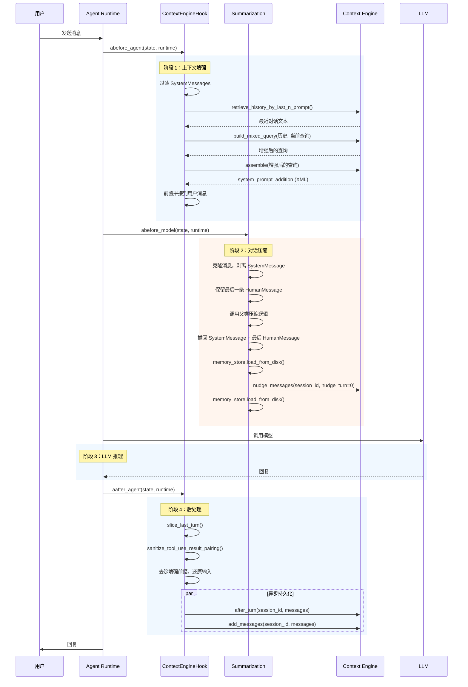

# Agent Middlewares — Agent 中间件系统

> **Agent Middlewares** 是 EMA AI Agent 的中间件层，位于 Agent 核心执行流程的关键节点，通过 LangChain 的 AOP 风格中间件框架，在模型推理的**前、中、后**阶段负责**上下文增强**、**对话压缩**和**记忆管理**。

---

## 目录

- [概述](#概述)
- [架构](#架构)
- [中间件详解](#中间件详解)
  - [ContextEngineHook](#contextenginehook)
  - [Summarization](#summarization)
- [对比](#对比)
- [工作流（时序图）](#工作流时序图)
- [生命周期](#生命周期)
- [核心机制](#核心机制)
- [数据模型](#数据模型)
- [配置](#配置)
- [使用示例](#使用示例)
- [FAQ](#faq)
- [技术栈](#技术栈)
- [许可证](#许可证)

---

## 概述

### 设计定位

Agent Middlewares 基于 LangChain 的中间件体系（`AgentMiddleware` / `SummarizationMiddleware`）实现，通过**切面编程（AOP）**的方式挂载到 Agent 执行流水线中，在每个推理周期的特定时机执行横切逻辑。

| 中间件 | 时机 | 职责 |
|--------|------|------|
| `ContextEngineHook` | Agent 推理前 & 推理后 | 从 Context Engine 检索技能记忆和长期记忆，构造增强提示词；推理完成后持久化对话 |
| `Summarization` | 模型调用前 | 对话历史过长时压缩上下文窗口，触发用户偏好提取 |

### 核心能力

1. **上下文增强** — 在 Agent 推理前，从 Skill Memory Graph 检索相关技能和记忆，构造增强 prompt
2. **对话压缩** — 在模型调用前压缩超长上下文窗口，防止 token 超限
3. **偏好提取** — 在压缩时同步触发用户偏好提取，将偏好写入长期 memory store
4. **自动持久化** — 每轮推理结束后通过 `asyncio.create_task` 自动将对话写入 MesMemory

---

## 架构

```
Agent 执行流水线：

┌─────────────────────────────────────────────────────────────┐
│                    Agent Runtime (LangGraph)                 │
├─────────────────────────────────────────────────────────────┤
│                                                              │
│  ① abefore_agent()                                           │
│     └─ ContextEngineHook.abefore_agent                       │
│        ├─ 从 state["messages"] 中过滤 SystemMessage          │
│        ├─ 提取最后一条 HumanMessage 内容                     │
│        └─ _build_turn_prompt(query_text):                    │
│           ├─ retrieve_history_by_last_n_prompt() → 对话轮次  │
│           ├─ build_mixed_query() → 增强后的查询              │
│           └─ assemble() → Skill Memory Graph 上下文          │
│              └─ 结果作为系统提示拼接到用户消息前              │
│                                                              │
│  ② abefore_model()                                           │
│     └─ Summarization.abefore_model (继承 SummarizationMW)    │
│        ├─ 复制消息列表，剥离 SystemMessage                    │
│        ├─ 保留最后一条 HumanMessage                           │
│        ├─ 调用父类压缩逻辑 → reduce_messages                 │
│        ├─ 重新插入 SystemMessage 和最后一条 HumanMessage      │
│        ├─ memory_store.load_from_disk()  (nudge 前)           │
│        ├─ nudge_messages(session_id, nudge_turn=0)           │
│        └─ memory_store.load_from_disk()  (nudge 后)           │
│                                                              │
│  ③ LLM 推理                                                  │
│                                                              │
│  ④ aafter_agent()                                            │
│     └─ ContextEngineHook.aafter_agent                        │
│        ├─ slice_last_turn() → 提取最后一轮对话               │
│        ├─ sanitize_tool_use_result_pairing() → 清理工具配对  │
│        ├─ 去除增强前缀，还原原始用户输入                      │
│        ├─ asyncio.create_task(after_turn())   → 异步学习     │
│        └─ asyncio.create_task(add_messages()) → 持久化       │
│                                                              │
└─────────────────────────────────────────────────────────────┘
```

### 执行顺序

```
1. abefore_agent  (ContextEngineHook)  —→  上下文增强
2. abefore_model  (Summarization)      —→  上下文压缩 + 偏好提取
3. LLM 模型调用
4. aafter_agent   (ContextEngineHook)  —→  记忆持久化 + 知识学习
```

---

## 中间件详解

### ContextEngineHook

**文件：** `context_engine_hook.py`

**类：** `ContextEngineHook(AgentMiddleware)`

在 Agent 推理**之前**增强用户消息，在 Agent 推理**之后**持久化对话。

#### `__init__(session_id: str)`

```python
hook = ContextEngineHook(session_id="session_001")
```

存储会话 ID 并初始化一个空的 `_turn_prompt` 字符串，该字符串将在 `abefore_agent` 期间被填充。

---

#### `_build_turn_prompt(query_text: str) -> None`

内部方法，通过编排三个 Context Engine 调用来构造增强前缀：

```python
async def _build_turn_prompt(self, query_text: str) -> None:
    # 1. 检索最近的对话轮次
    recent_messages_addition = retrieve_history_by_last_n_prompt(session_id=self._session_id)

    # 2. 基于历史重写查询（代词 → 实体）
    transformer_query_text = build_mixed_query(
        turns_of_history=recent_messages_addition,
        query=query_text
    )

    # 3. 检索 Skill Memory Graph 上下文
    assemble_result = await assemble(user_text=transformer_query_text)
    skill_system_prompt_addition = assemble_result.get("system_prompt_addition", "")

    # 构造结构化内容：上下文 + 指令
    self._turn_prompt = textwrap.dedent(f"""\
        {skill_system_prompt_addition}\n\n
        Using the reference materials above (note: they may contain inaccuracies,
        so use them critically), answer the user's actual question below.\n\n
    """)
```

**关键细节：**
- 增强前缀既包含 Skill Memory 图上下文，也包含一条批判性使用指令
- 前缀存储在 `self._turn_prompt` 中，稍后在 `aafter_agent` 中移除，防止上下文窗口膨胀

---

#### `abefore_agent(state, runtime)`

```
输入：用户原始消息 "如何部署 Docker？"
        │
        ▼
1. 从 state["messages"] 中过滤 SystemMessage（反向迭代，原地删除）
2. 提取最后一条 HumanMessage 的内容
3. 处理三种消息格式：
   ├─ 纯文本 str       → _build_turn_prompt() + 前置拼接
   ├─ 单媒体 dict      → 仅增强 "type":"text" 部分
   └─ 多媒体 list      → 找到文本项，原地增强
4. 将 self._turn_prompt 前置拼接到原始消息

输出："[技能记忆上下文 + 指令] 如何部署 Docker？"
```

**消息格式支持：**

| 输入类型 | 行为 |
|----------|------|
| `str` | 直接通过字符串拼接增强 |
| `dict`（单媒体） | 原地增强 `text` 键 |
| `list[dict]`（多媒体） | 找到 `type="text"` 项，原地增强 |
| 空/None 内容 | 返回 `None`（跳过） |

---

#### `aafter_agent(state, runtime)`

```
输入：完整的推理结果消息列表
        │
        ▼
1. slice_last_turn(all_messages) → 提取最后一轮对话
2. sanitize_tool_use_result_pairing(last_turn) → 清理工具调用/结果配对
3. 从清理后的最后一条人类消息中提取 user_text
4. 去除增强前缀：user_text = user_text.removeprefix(self._turn_prompt)
5. 将还原后的原始用户输入写回 last_human_message.content
6. 从后续消息中提取 AI 回复文本
7. 并发启动两个异步任务：
   ├─ after_turn(session_id, last_turn_messages)
   │   └─ Skill Memory 学习流水线（知识提取 + 图谱更新）
   └─ add_messages(session_id, messages)
       └─ 持久化到 MesMemory SQLite 存储
   └─ await asyncio.gather(task1, task2)
```

**关键细节：**

| 关注点 | 解决方案 |
|--------|----------|
| 非阻塞持久化 | `asyncio.create_task` + `asyncio.gather` |
| 上下文窗口管理 | 存储前去除增强前缀 |
| 工具调用完整性 | `sanitize_tool_use_result_pairing` 修复不均衡配对 |
| 多格式用户输入 | 与 `abefore_agent` 同理处理 `str`、`dict`、`list[dict]` |

---

### Summarization

**文件：** `summarization.py`

**类：** `Summarization(SummarizationMiddleware)`

在模型调用前压缩过长的对话历史，并在压缩时触发用户偏好提取。

#### `__init__(session_id: str, **kwargs)`

```python
summarizer = Summarization(session_id="session_001", ...)
```

`**kwargs` 转发给父类 `SummarizationMiddleware`（基础的压缩配置）。

---

#### `abefore_model(state, runtime)`

```
输入：可能超长的消息列表（如 100K+ token）
        │
        ▼
1. 复制状态 + 消息列表（避免修改原始）
2. 剥离 SystemMessage → 保存引用，从副本中删除
3. 保留最后一条 HumanMessage → 保存引用
4. 调用父类 SummarizationMiddleware.abefore_model(copy_state, runtime)
   └─ 对历史消息进行 LLM 摘要压缩
   └─ 返回 reduce_messages（包含 RemoveMessage 标记）
5. 在 reduce_messages 中的第一个 RemoveMessage 之后重新插入 SystemMessage
6. 如果保存的最后一条 HumanMessage != reduce_messages 中的最后一条，重新插入
7. memory_store.load_from_disk()  — 同步内存状态与磁盘
8. nudge_messages(session_id, nudge_turn=0)  — 强制偏好提取
9. memory_store.load_from_disk()  — 重新加载以捕获 nudge 写入
10. 返回 res（父类的结果字典）
```

**关键细节：**

| 关注点 | 解决方案 |
|--------|----------|
| SystemMessage 分离 | 压缩前剥离，避免污染语义密度 |
| 最新用户输入保留 | 压缩后重新插入最后一条 `HumanMessage`，确保 LLM 看到原始问题 |
| 数据一致性 | `memory_store.load_from_disk()` 在 nudge **前**和**后**各调用一次，确保内存状态与磁盘同步 |
| 强制提取 | `nudge_turn=0` 绕过正常的轮次间隔检查 |
| 不可变状态 | 消息列表被克隆，避免对原始 agent 状态的副作用 |

**为什么要分离 SystemMessage？**

系统提示（角色设定、工具定义等）与历史对话消息的语义分布有本质差异。将它们混入同一压缩过程会降低信息密度 — 摘要器会浪费容量，把（不变的系统提示）和（变化的对话）一起编码。压缩前剥离、压缩后重新插入，能显著提升摘要质量。

**为什么在 nudge 前后重载 memory_store？**

`memory_store` 是一个单例内存缓存，底层由磁盘上的 markdown 文件支持。如果其他 agent 或进程在上次加载后写入过磁盘，它可能已过时。nudge 前重载确保提取器看到最新状态；nudge 后重载确保后续读取能看到新写入的偏好。

---

## 对比

| 特性 | ContextEngineHook | Summarization |
|------|-------------------|---------------|
| **基类** | `AgentMiddleware` | `SummarizationMiddleware` |
| **触发时机** | Agent 前后 | 模型调用前 |
| **核心操作** | 上下文增强 + 持久化 | 压缩 + 偏好提取 |
| **阻塞性** | 异步非阻塞（after 部分） | 同步阻塞 |
| **依赖** | Context Engine（`assemble`、`after_turn`、`add_messages`） | MesMemory（`nudge_messages`）、`memory_store` |
| **频率** | 每轮 Agent 推理 | 仅上下文过长时（父类判断） |
| **消息变更** | 原地修改（增强 + 还原） | 克隆 + 修改副本 |

---

## 工作流（时序图）



---

## 生命周期

| 阶段 | ContextEngineHook | Summarization |
|------|-------------------|---------------|
| **Before Agent** | 剥离系统消息 → 提取查询 → 通过 Context Engine 构造增强 → 前置拼接到用户消息 | — |
| **Before Model** | — | 克隆状态 → 剥离系统消息 → 保留最后人类消息 → 调用父类压缩 → 插回系统消息 + 人类消息 → 重载 memory_store → nudge → 重载 memory_store |
| **LLM 推理** | — | — |
| **After Agent** | 提取最后一轮 → 清理工具配对 → 还原原始输入 → `after_turn()`（异步技能学习）→ `add_messages()`（异步持久化） | — |

---

## 核心机制

### 1. 基于 AOP 的中间件钩子

两个中间件都使用 LangChain 的 AOP 风格中间件框架。`ContextEngineHook` 继承 `AgentMiddleware` 以挂载到 Agent 生命周期（`abefore_agent` / `aafter_agent`）。`Summarization` 继承 `SummarizationMiddleware` 以挂载到模型生命周期（`abefore_model`）。

这种设计允许横切关注点（记忆、压缩）与核心 Agent 逻辑清晰地分离，无需修改 Agent 本身。

### 2. 三格式消息支持

`ContextEngineHook` 透明地处理三种不同的消息内容格式：

| 格式 | 示例 | 增强策略 |
|------|------|----------|
| `str` | `"如何部署？"` | 字符串拼接 |
| `dict` | `{"type": "text", "text": "你好"}` | 原地修改 `text` 键 |
| `list[dict]` | `[{"type": "text", ...}, {"type": "image_url", ...}]` | 找到文本项，原地增强 |

这确保了对纯文本和多模态工作流的兼容性。

### 3. 增强前缀生命周期

增强前缀在 `abefore_agent` 中注入，在 `aafter_agent` 中剥离：

```
注入（abefore_agent）：
  "[技能上下文 + 指令] 如何部署 Docker？"
                                   ↑ 增强部分
剥离（aafter_agent）：
  user_text.removeprefix(self._turn_prompt)
  → "如何部署 Docker？"   ← 还原原始
```

这防止了增强前缀在各轮之间积累到 MesMemory 中，否则会迅速消耗上下文窗口。

### 4. 压缩时强制 Nudge

Summarization 通过 `nudge_turn=0` 在压缩时强制进行偏好提取。这是一个刻意的权衡：

- **不强制**：嵌入在旧对话轮次中的偏好会在这些轮次被压缩为摘要时丢失
- **强制**：潜在偏好（如"我喜欢简洁的回答"）会在原始消息被摘要替代之前被提取并持久化

### 5. 异步非阻塞后处理

`ContextEngineHook.aafter_agent` 将 `after_turn()` 和 `add_messages()` 作为并发的 `asyncio.create_task` 调用启动，通过 `asyncio.gather` 聚合。这确保了：

- Agent 的响应延迟不受持久化或知识提取的影响
- 两个任务并发运行（提取和持久化并行）
- 如果任一任务失败，异常通过 `asyncio.gather` 传播（不会静默吞掉）

---

## 数据模型

### 状态消息类型

```python
from langchain_core.messages import BaseMessage, SystemMessage, HumanMessage, AIMessage, RemoveMessage
```

| 类型 | 在中间件中的角色 |
|------|------------------|
| `SystemMessage` | 在增强前（ContextEngineHook）和压缩前（Summarization）被剥离，防止污染 |
| `HumanMessage` | 作为增强的用户查询来源；在压缩期间保留最后一条 |
| `AIMessage` | 在 `aafter_agent` 中提取的 AI 回复来源 |
| `RemoveMessage` | 由父类 `SummarizationMiddleware` 插入的标记，用于标记要移除的消息 |

### 上下文增强状态

```
self._turn_prompt: str
  └─ 在 abefore_agent 期间构建的增强前缀
  └─ 格式：[skill_memory_context] + instruction_text
  └─ 使用：abefore_agent（前置拼接）→ aafter_agent（removeprefix）
```

### Memory Store 状态

`memory_store` 是由 `Summarization` 中间件管理的单例模块级对象（`from tools import memory_store`）：

- **类型**：内存缓存，底层由磁盘上的 markdown 文件支持
- **读取**：`memory_store.load_from_disk()` — 将内存状态与磁盘同步
- **写入**：`nudge_messages()` — 将提取的偏好写入 markdown 文件
- **一致性**：在 nudge 前后各加载一次，防止读取过期数据

---

## 配置

| 配置项 | ContextEngineHook | Summarization |
|--------|-------------------|---------------|
| **会话 ID** | `session_id`（构造函数） | `session_id`（构造函数） |
| **历史轮次** | N/A（委托给 `retrieve_history_by_last_n_prompt()` — 默认 5 轮） | — |
| **强制 Nudge** | — | `nudge_turn=0`（始终强制提取） |
| **消息格式支持** | `str`、`dict`、`list[dict]` | `list[BaseMessage]`（标准 LangGraph 格式） |
| **父类配置** | — | 通过 `**kwargs` 转发给 `SummarizationMiddleware` |

---

## 使用示例

### 注册中间件

```python
from agent.middlewares import ContextEngineHook, Summarization

# 创建中间件实例
context_hook = ContextEngineHook(session_id="session_001")
summarizer = Summarization(session_id="session_001")

# 注册到 LangGraph Runtime
# Runtime 在构造时或通过 add_middleware 接收中间件
runtime = Runtime(
    agent=my_agent,
    middlewares=[context_hook, summarizer]
    # 执行顺序：ContextEngineHook.abefore_agent →
    # Summarization.abefore_model → LLM → ContextEngineHook.aafter_agent
)
```

### 独立使用 ContextEngineHook

```python
from agent.middlewares import ContextEngineHook

hook = ContextEngineHook(session_id="session_001")

# 通常由 LangGraph Runtime 调用，但也可直接调用以进行测试：
await hook.abefore_agent(state, runtime)
# → state["messages"][-1].content 现在已被增强

# ... LLM 推理之后 ...
await hook.aafter_agent(state, runtime)
# → 对话持久化到 MesMemory，Skill Memory 更新
```

### 独立使用 Summarization

```python
from agent.middlewares import Summarization
from langgraph.runtime import Runtime

summarizer = Summarization(
    session_id="session_001",
    # 额外的 SummarizationMiddleware 关键字参数放在这里
)

# 由 LangGraph Runtime 在模型推理前调用：
await summarizer.abefore_model(state, runtime)
# → 长上下文被压缩，偏好被提取
```

---

## FAQ

### Q1: ContextEngineHook 为什么要过滤 SystemMessage？

在 `abefore_agent` 中过滤 SystemMessage，是为了防止系统提示（角色设定、工具定义等）被作为查询上下文传给 Context Engine，从而确保技能记忆和长期记忆的召回准确性。`system_prompt_addition` 通过增强前缀独立返回。

### Q2: Summarization 为什么要在压缩时强制提取偏好？

压缩意味着上下文窗口正在缩小，旧的对话历史将被摘要替代。如果不在此时提取偏好，隐含在旧轮次中的细节（如用户明确陈述的偏好）将永久丢失。强制提取确保即使在原始对话被摘要化之后，偏好仍能持久化到长期 memory store 中。

### Q3: 在 `aafter_agent` 中使用 `asyncio.create_task` 有什么风险？

`after_turn` 和 `add_messages` 通过 `asyncio.create_task` 异步运行，并通过 `asyncio.gather` 聚合。与原始的 `create_task`（可能静默吞掉异常）不同，`gather` 会传播异常。但：
- 如果 Agent 进程在 `create_task` 和 `gather` 之间异常退出，未完成的任务仍可能丢失
- `gather` 确保两个任务在 `aafter_agent` 完成前执行完毕 — 因此异常处理是有保障的
- 这是一个可接受的权衡：后处理可靠性受限于异步事件循环的生命周期

### Q4: 中间件的执行顺序如何保证？

执行顺序由 LangGraph Runtime 内部的中间件链控制。顺序为：
1. `abefore_agent` → `abefore_model` → LLM → `aafter_agent`
2. 同一阶段的多个中间件按注册先后顺序执行

### Q5: 如果 `_build_turn_prompt` 失败会怎样？

如果 `_build_turn_prompt` 抛出异常（例如 Context Engine 不可用），`abefore_agent` 会将错误向上传播到 LangGraph Runtime。中间件框架默认不捕获异常 — 如果增强是关键逻辑，调用方应在运行时层面处理错误。

### Q6: Summarization 为什么要克隆消息列表？

Summarization 中间件在处理前克隆消息列表，以避免对原始 `state["messages"]` 产生副作用。这是因为：
- 父类 `SummarizationMiddleware.abefore_model` 需要一个它可以自由修改的可变副本
- 在 Runtime 正式应用中间件结果之前，原始状态不应被触碰
- 克隆可以防止下游处理器看到部分修改后的状态

### Q7: 多媒体内容在增强时如何处理？

对于 `list[dict]`（多媒体）消息，仅增强 `type="text"` 部分。图片和其他媒体项保持不变。增强后的内容会原地写回到同一文本项中，保持原始消息结构不变。

---

## 技术栈

| 组件 | 技术选型 |
|------|----------|
| **中间件框架** | LangChain `AgentMiddleware` / `SummarizationMiddleware` |
| **Agent 运行时** | LangGraph `Runtime` |
| **消息模型** | LangChain `BaseMessage` / `SystemMessage` / `HumanMessage` / `AIMessage` / `RemoveMessage` |
| **记忆系统** | Context Engine（Skill Memory Graph + MesMemory） |
| **存储（MesMemory）** | SQLite + FTS5 |
| **存储（Memory Store）** | 磁盘 markdown 文件（`.md`），加载到内存单例 |
| **异步框架** | `asyncio.create_task` + `asyncio.gather` |
| **工具函数** | `textwrap.dedent`（增强 prompt 格式化） |
| **外部辅助** | `pub_func.slice_last_turn`、`pub_func.sanitize_tool_use_result_pairing` |

---

## 许可证

本项目遵循 EMA AI Agent 的 MIT 开源协议。

---

**作者：** MOYE  
**最后更新：** 2026-06-02
