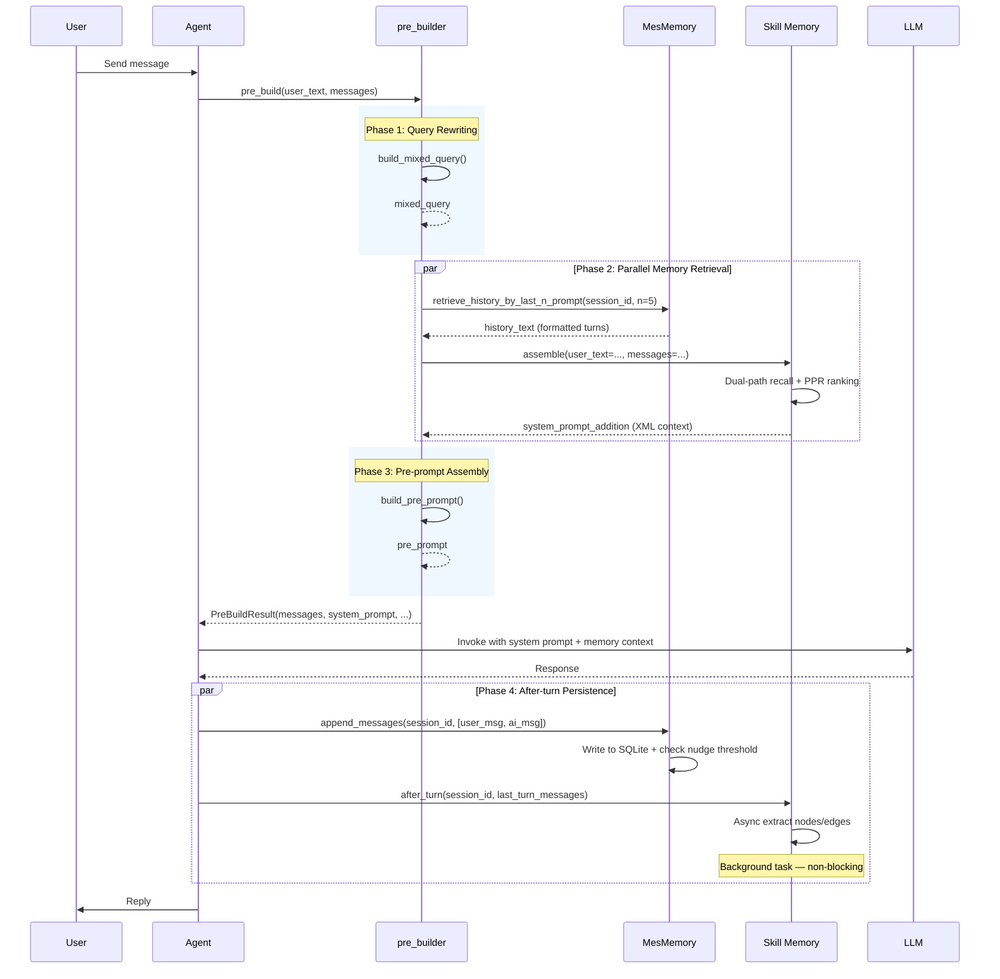

# Context Engine — Context Engine

[**中文文档**](README.zh.md) | **English**

> **Context Engine** is the context engine of the EMA AI Agent, consisting of two complementary modules: **MesMemory** (session message memory) and **Skill Memory** (long-term knowledge graph memory). It provides the Agent with both short-term conversational awareness and long-term accumulated knowledge.

---

## Table of Contents

- [Overview](#overview)
- [Comparison: MesMemory vs Skill Memory](#comparison-mesmemory-vs-skill-memory)
- [Architecture](#architecture)
- [Workflow](#workflow)
- [Lifecycle](#lifecycle)
- [Pre-builder (`pre_builder.py`)](#pre-builder-pre_builderpy)
- [Data Model](#data-model)
- [Core Mechanisms](#core-mechanisms)
- [Sub-module Documentation](#sub-module-documentation)
- [Configuration](#configuration)
- [Usage Examples](#usage-examples)
- [FAQ](#faq)
- [Tech Stack](#tech-stack)
- [License](#license)

---

## Overview

### Design Philosophy

The Context Engine bridges the gap between **conversational immediacy** and **persistent knowledge**. It avoids a single monolithic memory design by separating concerns into two specialized subsystems:

| Concern | Solution |
|---------|----------|
| "What did we just talk about?" | MesMemory — short-term session message store |
| "What did the user teach me before?" | Skill Memory — long-term structured knowledge graph |

This separation enables the Agent to handle parallel sessions, cross-session knowledge accumulation, and efficient retrieval without context window explosion.

### Core Capabilities

1. **Dual Memory Architecture** — Short-term message history (MesMemory) + long-term knowledge graph (Skill Memory)
2. **Unified Pre-build API** — `pre_build()` orchestrates both modules, returning a merged context payload
3. **Query Rewriting** — `build_mixed_query()` rewrites user queries with conversation history for ambiguity resolution
4. **Pre-prompt Assembly** — `build_pre_prompt()` constructs a full system prompt enriched with both memory contexts
5. **Async Non-blocking Updates** — Skill Memory extraction runs in the background, MesMemory writes are synchronous and immediate

---

## Comparison: MesMemory vs Skill Memory

| Aspect | MesMemory | Skill Memory |
|--------|-----------|-------------|
| **Type** | Short-term session memory | Long-term knowledge graph |
| **What it stores** | Raw conversation text | Extracted structured knowledge (TASK/SKILL/EVENT) |
| **Granularity** | Full message text | Triple-based knowledge nodes |
| **Cross-session** | No (per-session isolation) | Yes (accumulates across all sessions) |
| **Retrieval method** | FTS5 full-text search + turn-range queries | Graph traversal + PPR + vector search + FTS5 |
| **Update pattern** | Sync append (immediate persistence) | Async extraction (background LLM calls) |
| **Maintenance** | Nudge-based preference extraction (periodic) | Community detection + dedup + PageRank (periodic) |
| **Persistence** | SQLite + FTS5 (unicode61 + trigram) | SQLite + graph + vectors + FTS5 |
| **Output format** | Formatted conversation string | XML-wrapped graph context (`<skill_memory>`) |

---

## Architecture

```
context_engine/
│
├── pre_builder.py              # Unified pre-build API entry
│
├── mes_memory/                 # Short-term session message memory
│   ├── __init__.py
│   ├── core.py                 # Business logic (retrieval, search, nudge)
│   └── store/                  # Data layer
│       ├── db.py               # SQLite connection, WAL mode, migrations
│       └── core.py             # CRUD: add/get/query messages, update sessions
│
├── mes_memory/README.md        # MesMemory documentation (EN)
├── mes_memory/README.zh.md     # MesMemory documentation (ZH)
│
└── skill_memory/               # Long-term knowledge graph
    ├── __init__.py
    ├── core.py                 # Orchestrator (assemble, ingest, after_turn)
    ├── extractor/              # LLM-based node/edge extraction
    │   └── core.py
    ├── recaller/               # Dual-path recall (precise + generalized)
    │   └── core.py
    ├── graph/                  # Community detection, PageRank, dedup
    │   ├── community.py
    │   ├── pagerank.py
    │   └── dedup.py
    └── store/                  # SQLite CRUD, vectors, FTS5
        └── core.py
```

### Module Responsibilities

| Module | Path | Type | Scope | Persistence | Core Function |
|--------|------|------|-------|-------------|---------------|
| **pre_builder** | `pre_builder.py` | Orchestrator | Engine-wide entry | None (transient) | Query rewriting + dual-module context assembly |
| **MesMemory core** | `mes_memory/core.py` | Business logic | Per-session messages | SQLite + FTS5 | Retrieve, search, nudge preference extraction |
| **MesMemory store** | `mes_memory/store/` | Data layer | Per-session messages | SQLite + FTS5 | CRUD operations, message persistence |
| **Skill Memory core** | `skill_memory/core.py` | Orchestrator | Cross-session graph | SQLite + graph + vectors | Assemble, ingest, after_turn lifecycle |
| **Skill Extractor** | `skill_memory/extractor/` | Extraction | Cross-session graph | LLM-dependent | Node/edge identification from dialogue |
| **Skill Recaller** | `skill_memory/recaller/` | Retrieval | Cross-session graph | SQLite + vectors | Dual-path recall (precise + generalized) |
| **Skill Graph** | `skill_memory/graph/` | Maintenance | Cross-session graph | SQLite | Community detection, PageRank, dedup |
| **Skill Store** | `skill_memory/store/` | Data layer | Cross-session graph | SQLite + FTS5 + vectors | CRUD, graph traversal, FTS5 search |

---

## Workflow

### Full Request Lifecycle

```
User Message
    │
    ▼
┌────────────────────────────────────────────────────────────┐
│                    pre_build()                               │
│                                                            │
│  ┌──────────────────────────────────────┐                   │
│  │ 1. build_mixed_query()               │                   │
│  │    Rewrite query with history context│                   │
│  └────────────┬─────────────────────────┘                   │
│               │ mixed_query                                 │
│               ▼                                             │
│  ┌──────────────────────────────────────┐                   │
│  │ 2. MesMemory: retrieve history       │                   │
│  │    Get last N turns → format prompt  │                   │
│  └────────────┬─────────────────────────┘                   │
│               │ history_text                                │
│               ▼                                             │
│  ┌──────────────────────────────────────┐                   │
│  │ 3. Skill Memory: assemble()          │                   │
│  │    Dual-path recall → PPR rank       │                   │
│  │    → format XML context              │                   │
│  └────────────┬─────────────────────────┘                   │
│               │ system_prompt_addition                      │
│               ▼                                             │
│  ┌──────────────────────────────────────┐                   │
│  │ 4. build_pre_prompt()                │                   │
│  │    Merge → cognitive system prompt   │                   │
│  └────────────┬─────────────────────────┘                   │
│               │ pre_prompt                                  │
└────────────────┬────────────────────────────────────────────┘
                 │
                 ▼
        ┌────────────────┐
        │  LLM Response   │
        └────────┬───────┘
                 │
                 ▼
    ┌──────────────────────────────┐
    │ After-turn processing        │
    │                              │
    │ ● MesMemory.append_messages()│ ← sync write
    │ ● Skill Memory.after_turn()  │ ← async extract
    └──────────────────────────────┘
```

### Sequence Diagram



---

## Lifecycle

| Phase | pre_builder | MesMemory | Skill Memory |
|-------|-------------|-----------|-------------|
| **Before response** | `build_mixed_query()` → `retrieve_history()` → `assemble()` → `build_pre_prompt()` | Retrieve last N turns → format as prompt | Assemble graph context → inject as `<skill_memory>` XML |
| **During response** | (complete) | (none) | (none) |
| **After each turn** | — | Write messages, check nudge threshold (every 10 turns) | Async extract nodes/edges, periodic community maintenance (every 6 turns) |
| **Session end** | — | (nothing special) | Final review, promote EVENT→SKILL, run graph maintenance |

---

## Pre-builder (`pre_builder.py`)

`pre_builder.py` is the **unified entry point** for the entire Context Engine. It orchestrates query rewriting, dual-module memory retrieval, and pre-prompt assembly in a single call.

### `build_mixed_query()`

Rewrites the user's current query using conversation history to resolve ambiguous references.

```python
from context_engine.pre_builder import build_mixed_query

# Without history: returns the original query unchanged
mixed = build_mixed_query("How does it work?")
# Returns: "How does it work?" (no history → no rewrite)

# With history: rewrites pronouns and resolves ambiguity
history = "<turn>\n" \
          "User: What is Docker?\n\n" \
          "Assistant: Docker is a containerization platform...\n" \
          "</turn>"
mixed = build_mixed_query("How do I install it?", history)
# Returns: "How do I install Docker?" (rewritten)
```

**Key behaviors:**

| Input Condition | Behavior |
|----------------|----------|
| Empty/whitespace query | Returns `""` |
| No history provided | Returns original query unchanged |
| History provided | LLM rewrites: replaces pronouns, resolves ambiguous references |
| LLM returns empty | Falls back to original query (safety guard) |

**Prompt design:**

The LLM is instructed with:
- Replace "you" with the AI's name (`ASSISTANT_NAME`)
- Replace pronouns (she/it/he/她/它/他) with actual names
- Resolve ambiguous references using conversation history
- Never return empty — always return rewritten or original query
- Return ONLY the rewritten text (no JSON, no explanations)

---

### `build_pre_prompt()`

Assembles the complete system prompt by merging the core cognitive prompt with both MesMemory history and Skill Memory graph context.

```python
from context_engine.pre_builder import build_pre_prompt

# Inside pre_build() — users call pre_build(), not this directly
full_prompt = build_pre_prompt(
    system_prompt_core="You are a helpful AI assistant...",
    system_prompt_addition="<skill_memory>...</skill_memory>",
    history_text="...",
)
```

**Output structure:**

The pre-prompt is assembled as:

```
[Core system prompt]
    │
    ├── Skill Memory context (if available)
    │   └── <skill_memory> ... relevant graph nodes/edges ... </skill_memory>
    │
    └── MesMemory history (if available)
        └── Recent conversation turns formatted as prompt
```

### `pre_build()` — Unified Entry

```python
from context_engine.pre_builder import pre_build

# === Minimal call ===
result = await pre_build(
    user_text="How to deploy with Docker?",
    messages=conversation_history
)

# === Result structure ===
# result.messages              → Normalized message list (LangChain BaseMessage[])
# result.estimated_tokens      → Estimated token count
# result.system_prompt_addition → XML-wrapped Skill Memory graph context
# result.history_text          → Formatted MesMemory conversation turns
# result.pre_prompt            → Fully assembled system prompt
# result.mixed_query           → Rewritten query (or original if no history)

# If no messages provided, returns gracefully with empty results
result = await pre_build(user_text="Hello")
# → mixed_query="Hello", history_text="", system_prompt_addition=""
```

**Key behaviors:**

| Input Condition | Behavior |
|----------------|----------|
| No messages (`None` or empty) | Returns empty history + no skill context + original query |
| Messages provided | Full pipeline: rewrite → retrieve → assemble → build prompt |
| pre_builder module not available | Falls back to returning empty context (graceful degradation) |

---

## Data Model

### PreBuildResult

```python
class PreBuildResult(BaseModel):
    messages: List[BaseMessage]          # Normalized message list
    estimated_tokens: int                # Estimated token count
    system_prompt_addition: str          # XML skill memory context (or "")
    history_text: str                    # MesMemory dialog context (or "")
    pre_prompt: str                      # Fully assembled system prompt
    mixed_query: str                     # Rewritten query
```

### MesMemory Schema

Defined in `mes_memory/store/db.py`:

```sql
-- Sessions table
CREATE TABLE sessions (
    session_id TEXT PRIMARY KEY,
    nudge_turn_num INTEGER NOT NULL DEFAULT 0
);

-- Messages table
CREATE TABLE messages (
    id            INTEGER PRIMARY KEY AUTOINCREMENT,
    turn_num      INTEGER NOT NULL,
    session_id    TEXT NOT NULL,
    role          TEXT NOT NULL,        -- human / ai / tool
    content       TEXT,                 -- Message content (JSON-encoded)
    tool_call_id  TEXT,                 -- Tool call ID
    tool_calls    TEXT,                 -- Tool call details (JSON)
    tool_status   TEXT,                 -- Tool execution status
    tool_name     TEXT,                 -- Tool name
    timestamp     TEXT NOT NULL,        -- YYYYMMDDHHmmss
    finish_reason TEXT,                 -- AI response finish reason
    reasoning     TEXT,                 -- Reasoning content
    reasoning_content TEXT              -- Reasoning process
);

-- FTS5 tables
CREATE VIRTUAL TABLE messages_fts USING fts5(content);
CREATE VIRTUAL TABLE messages_fts_trigram USING fts5(
    content, tokenize='trigram'
);

-- Indexes
CREATE INDEX idx_messages_timestamp ON messages(session_id, timestamp);
CREATE INDEX idx_messages_turn_num ON messages(session_id, turn_num);

-- FTS5 sync triggers (auto-maintained on INSERT/UPDATE/DELETE)
```

### Skill Memory Schema

Defined in `skill_memory/store/core.py`:

```sql
-- Nodes table
CREATE TABLE gm_nodes (
    id TEXT PRIMARY KEY,
    type TEXT NOT NULL,              -- TASK / SKILL / EVENT
    name TEXT UNIQUE NOT NULL,
    description TEXT,
    content TEXT NOT NULL,
    validated_count INTEGER DEFAULT 1,
    source_sessions TEXT,            -- JSON array of session IDs
    community_id TEXT,
    pagerank REAL DEFAULT 0,
    created_at INTEGER,
    updated_at INTEGER
);

-- Edges table
CREATE TABLE gm_edges (
    id TEXT PRIMARY KEY,
    from_id TEXT NOT NULL,
    to_id TEXT NOT NULL,
    type TEXT NOT NULL,              -- USED_SKILL / SOLVED_BY / REQUIRES / PATCHES / CONFLICTS_WITH
    instruction TEXT NOT NULL,
    condition TEXT,
    session_id TEXT,
    created_at INTEGER,
    FOREIGN KEY (from_id) REFERENCES gm_nodes(id),
    FOREIGN KEY (to_id) REFERENCES gm_nodes(id)
);

-- Vectors table
CREATE TABLE gm_vectors (
    node_id TEXT PRIMARY KEY,
    content_hash TEXT NOT NULL,
    embedding TEXT NOT NULL,          -- JSON array
    FOREIGN KEY (node_id) REFERENCES gm_nodes(id)
);

-- Community summaries table
CREATE TABLE gm_communities (
    id TEXT PRIMARY KEY,
    summary TEXT NOT NULL,
    node_count INTEGER,
    embedding TEXT,                   -- JSON array
    created_at INTEGER,
    updated_at INTEGER
);

-- FTS5 tables (with content sync)
CREATE VIRTUAL TABLE gm_nodes_fts USING fts5(text, content='gm_nodes', content_rowid='rowid');
CREATE VIRTUAL TABLE gm_nodes_fts_trigram USING fts5(text, content='gm_nodes', content_rowid='rowid', tokenize='trigram');
```

---

## Core Mechanisms

### 1. Query Rewriting (Disambiguation)

`build_mixed_query()` uses an LLM to resolve ambiguous pronouns and incomplete references in user queries by leveraging conversation history. This ensures that downstream memory retrieval (both MesMemory FTS5 and Skill Memory graph recall) receives a well-formed, self-contained query.

**Key design points:**
- **AI name substitution**: "you" → `ASSISTANT_NAME` (e.g., "you" → "小雪")
- **Pronoun resolution**: "it", "she", "they" → resolved to actual entities
- **Safety fallback**: If LLM returns empty, the original query is preserved
- **No-op for fresh conversations**: Without history, the query is returned unchanged

### 2. Dual-Module Context Assembly

`pre_build()` orchestrates two fundamentally different memory systems in parallel:

| Module | Retrieval Strategy | Output Format |
|--------|-------------------|---------------|
| MesMemory | Turn-range query (last N turns) | Raw conversation string |
| Skill Memory | Dual-path recall + PPR ranking | XML-wrapped graph context |

Both outputs are merged into the final pre-prompt, providing the LLM with both "what was just said" and "what the system knows about this topic."

### 3. Unified Pre-prompt Construction

`build_pre_prompt()` assembles a complete system prompt by layering:

```
[Cognitive core prompt]
    │
    ├── Skill Memory context (graph nodes/edges)
    │
    └── MesMemory history (recent turns)
```

This layered structure ensures the LLM receives:
1. Its base personality and behavior instructions (core prompt)
2. Relevant long-term knowledge (graph context)
3. Immediate conversational context (recent history)

### 4. Graceful Degradation

All components handle missing or empty inputs:

| Failure Point | Behavior |
|---------------|----------|
| No conversation history | Empty history text, no query rewrite |
| Skill Memory not initialized | Empty `system_prompt_addition` |
| pre_builder module unavailable | Zero-length string fallback for all fields |
| LLM query rewrite failure | Original query preserved |

---

## Sub-module Documentation

- [MesMemory — Session Message Memory](mes_memory/README.md) — Short-term conversation history, FTS5 search, preference extraction
- [Skill Memory — Knowledge Graph Memory](skill_memory/README.md) — Long-term structured knowledge graph with auto-extraction and dual-path recall

---

## Configuration

Configuration is managed per-module. Refer to their respective documentation for details:

| Config | MesMemory | Skill Memory |
|--------|-----------|-------------|
| History turns | `retrieve_history_by_last_n_prompt(n=5)` | — |
| Recall nodes | — | `recall_max_nodes=6` |
| Graph traversal depth | — | `recall_max_depth=2` |
| Nudge / compact interval | `nudge_turn=10` | `compact_turn_count=6` |
| Database path | `store/mes_memory/mes_memory.db` | `skill_memory.db` |
| Dedup threshold | — | `dedup_threshold=0.90` |
| PageRank damping | — | `pagerank_damping=0.85` |
| PageRank iterations | — | `pagerank_iterations=20` |

---

## Usage Examples

### Basic Integration

```python
from context_engine.pre_builder import pre_build

# === Full pipeline ===
result = await pre_build(
    user_text="How to deploy with Docker?",
    messages=conversation_history
)

# Use the assembled pre-prompt as the system message
system_prompt = result.pre_prompt

# The mixed_query is the disambiguated version of the user's query
user_query = result.mixed_query

# Invoke the LLM with the enriched context
response = await llm.ainvoke([
    SystemMessage(content=system_prompt),
    HumanMessage(content=user_query)
])
```

### Direct Module Access

```python
from context_engine.mes_memory import retrieve_history_by_last_n_prompt, search_messages

# Get last 5 turns
history = retrieve_history_by_last_n_prompt(session_id="session_001", n=5)

# Search for specific content
results = search_messages(
    query="Docker image",
    session_id="session_001",
    role_filter=["human", "ai"]
)
```

```python
from context_engine.skill_memory import assemble, ingest_message, after_turn

# Before each LLM call: assemble graph context
context = await assemble(user_text="How to deploy?", messages=history)

# After each turn: persist and extract
ingest_message(session_id, user_message)
ingest_message(session_id, ai_message)
await after_turn(session_id, [user_message, ai_message])
```

---

## FAQ

### What's the difference between the two modules?

| Aspect | MesMemory | Skill Memory |
|--------|-----------|-------------|
| What it stores | Raw conversation text | Extracted structured knowledge |
| Granularity | Full message text | TASK/SKILL/EVENT triplets |
| Cross-session | No (per-session) | Yes (accumulates across sessions) |
| Retrieval method | FTS5 full-text search | Graph traversal + PPR + vector search |
| Update pattern | Sync append | Async extraction |

### Do I need both?

Yes. MesMemory provides the raw conversation context needed for the current session. Skill Memory provides accumulated knowledge from past sessions. Together they form a complete memory system. The `pre_build()` API handles both automatically.

### How does query rewriting work?

`build_mixed_query()` sends the user's query plus conversation history to an LLM, which rewrites pronouns ("it", "you", "she") into their concrete referents. For example, "How do I install it?" with history about Docker becomes "How do I install Docker?" This improves downstream FTS5 and graph retrieval accuracy.

### What happens if Skill Memory is not configured?

The `pre_build()` function handles this gracefully — `system_prompt_addition` will be an empty string, and the pre-prompt will only contain the MesMemory history and core system prompt.

### Can I use MesMemory without Skill Memory?

Yes. MesMemory is fully independent. Call `retrieve_history_by_last_n_prompt()` and `append_messages()` directly. The `pre_build()` wrapper requires both modules but degrades gracefully if Skill Memory is absent.

### How do I set up the Context Engine?

1. Ensure SQLite is available (no external database server required)
2. Initialize MesMemory: tables are auto-created on first write via migrations
3. Initialize Skill Memory: configure `GmConfig` with embedding model and LLM
4. Call `pre_build()` before each LLM interaction for full memory context

### How is token usage managed?

- MesMemory: only retrieves the last N turns (configurable, default 5)
- Skill Memory: only recalls K nodes (configurable, default 6)
- Combined token overhead is typically 1.5K–3K tokens, independent of total conversation length

---

## Tech Stack

| Component | Technology |
|-----------|-----------|
| **Language** | Python 3.12+ |
| **Database** | SQLite 3 + WAL mode |
| **Full-Text Search** | FTS5 (unicode61 + trigram tokenizers) |
| **Vector Storage** | JSON field in SQLite |
| **Graph Algorithm** | igraph + Leiden Algorithm |
| **PageRank** | Custom Python implementation |
| **Embedding Model** | BGE/BAAI series |
| **LLM Framework** | LangChain (Callbacks, BaseMessage, BaseChatModel) |
| **Async Framework** | asyncio |
| **Skill Memory Config** | `GmConfig` (Pydantic BaseModel) |

---

## License

This project follows the open-source license of the EMA AI Agent.

---

**Author:** MOYE  
**Last updated:** 2026-06-02
