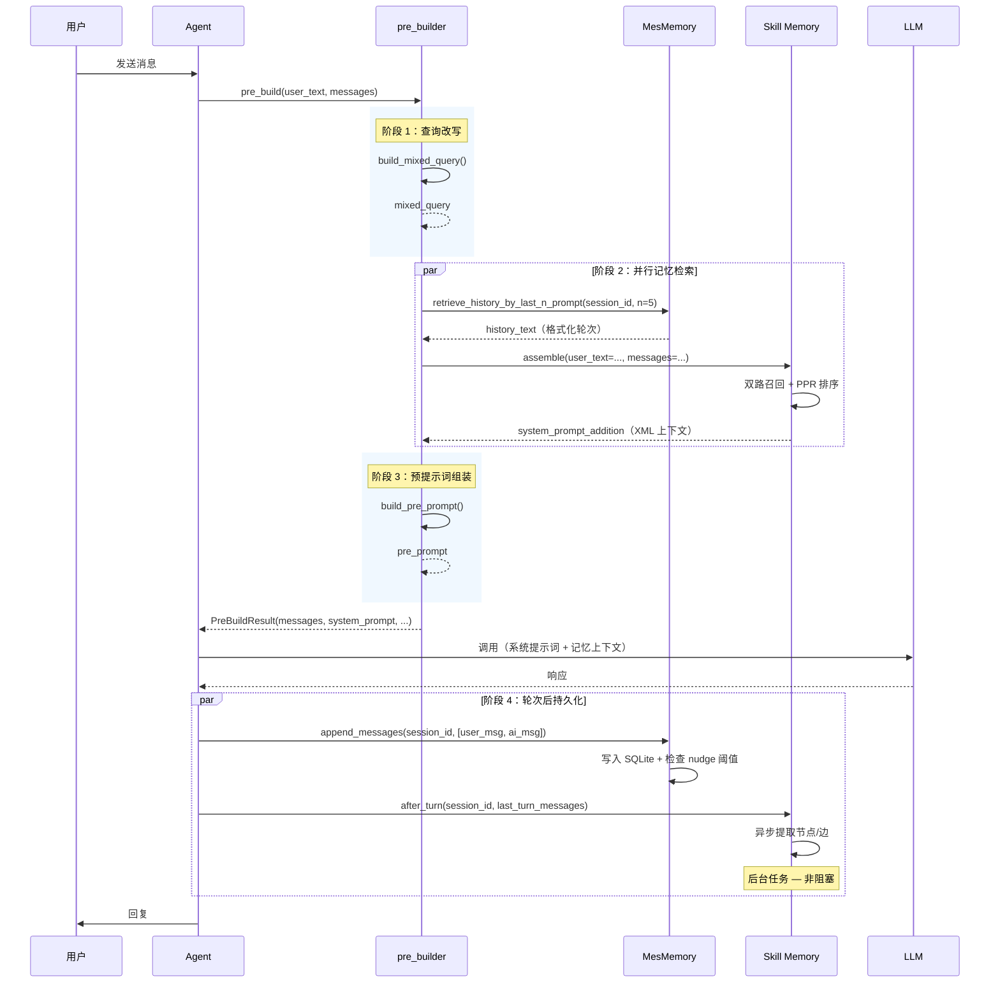

# Context Engine — 上下文引擎

[**English**](README.md) | **中文文档**

> **Context Engine** 是 EMA AI Agent 的上下文引擎，由两个互补模块组成：**MesMemory**（会话消息记忆）和 **Skill Memory**（长期知识图谱记忆）。它为 Agent 同时提供短期会话感知能力和长期累积知识。

---

## 目录

- [概述](#概述)
- [对比：MesMemory vs Skill Memory](#对比mesmemory-vs-skill-memory)
- [架构](#架构)
- [工作流程](#工作流程)
- [生命周期](#生命周期)
- [预构建器（`pre_builder.py`）](#预构建器-pre_builderpy)
- [数据模型](#数据模型)
- [核心机制](#核心机制)
- [子模块文档](#子模块文档)
- [配置](#配置)
- [使用示例](#使用示例)
- [常见问题](#常见问题)
- [技术栈](#技术栈)
- [许可证](#许可证)

---

## 概述

### 设计理念

Context Engine 在**对话即时性**和**持久化知识**之间架起了一座桥梁。它没有采用单一的全能记忆设计，而是将关注点分离为两个专门的子系统：

| 关注点 | 解决方案 |
|--------|----------|
| "我们刚才聊了什么？" | MesMemory — 短期会话消息存储 |
| "用户之前教过我什么？" | Skill Memory — 长期结构化知识图谱 |

这种分离使 Agent 能够处理并行的多会话、跨会话知识积累以及高效检索，而不会导致上下文窗口爆炸。

### 核心能力

1. **双记忆架构** — 短期消息历史（MesMemory）+ 长期知识图谱（Skill Memory）
2. **统一预构建 API** — `pre_build()` 编排两个模块，返回合并后的上下文载荷
3. **查询改写** — `build_mixed_query()` 结合对话历史重写用户查询，消除歧义
4. **预提示词组装** — `build_pre_prompt()` 构建包含两种记忆上下文的完整系统提示词
5. **异步非阻塞更新** — Skill Memory 提取在后台运行，MesMemory 写入为同步即时操作

---

## 对比：MesMemory vs Skill Memory

| 方面 | MesMemory | Skill Memory |
|------|-----------|-------------|
| **类型** | 短期会话记忆 | 长期知识图谱 |
| **存储内容** | 原始对话文本 | 提取的结构化知识（TASK/SKILL/EVENT） |
| **粒度** | 完整消息文本 | 基于三元组的知识节点 |
| **跨会话** | 否（按会话隔离） | 是（跨所有会话累积） |
| **检索方式** | FTS5 全文搜索 + 轮次范围查询 | 图遍历 + PPR + 向量搜索 + FTS5 |
| **更新模式** | 同步写入（即时持久化） | 异步提取（后台 LLM 调用） |
| **维护机制** | Nudge 偏好提取（定期） | 社区检测 + 去重 + PageRank（定期） |
| **持久化** | SQLite + FTS5（unicode61 + trigram） | SQLite + 图 + 向量 + FTS5 |
| **输出格式** | 格式化的对话字符串 | XML 包裹的图谱上下文（`<skill_memory>`） |

---

## 架构

```
context_engine/
│
├── pre_builder.py              # 统一预构建 API 入口
│
├── mes_memory/                 # 短期会话消息记忆
│   ├── __init__.py
│   ├── core.py                 # 业务逻辑（检索、搜索、nudge）
│   └── store/                  # 数据层
│       ├── db.py               # SQLite 连接、WAL 模式、迁移
│       └── core.py             # CRUD：添加/获取/查询消息、更新会话
│
├── mes_memory/README.md        # MesMemory 文档（英文）
├── mes_memory/README.zh.md     # MesMemory 文档（中文）
│
└── skill_memory/               # 长期知识图谱
    ├── __init__.py
    ├── core.py                 # 编排器（assemble、ingest、after_turn）
    ├── extractor/              # 基于 LLM 的节点/边提取
    │   └── core.py
    ├── recaller/               # 双路召回（精确 + 泛化）
    │   └── core.py
    ├── graph/                  # 社区检测、PageRank、去重
    │   ├── community.py
    │   ├── pagerank.py
    │   └── dedup.py
    └── store/                  # SQLite CRUD、向量、FTS5
        └── core.py
```

### 模块职责

| 模块 | 路径 | 类型 | 范围 | 持久化 | 核心功能 |
|------|------|------|------|--------|---------|
| **pre_builder** | `pre_builder.py` | 编排器 | 引擎全局入口 | 无（临时） | 查询改写 + 双模块上下文组装 |
| **MesMemory 核心** | `mes_memory/core.py` | 业务逻辑 | 按会话消息 | SQLite + FTS5 | 检索、搜索、nudge 偏好提取 |
| **MesMemory 存储** | `mes_memory/store/` | 数据层 | 按会话消息 | SQLite + FTS5 | CRUD 操作、消息持久化 |
| **Skill Memory 核心** | `skill_memory/core.py` | 编排器 | 跨会话图谱 | SQLite + 图 + 向量 | assemble、ingest、after_turn 生命周期 |
| **Skill 提取器** | `skill_memory/extractor/` | 提取 | 跨会话图谱 | LLM 依赖 | 从对话中识别节点/边 |
| **Skill 召回器** | `skill_memory/recaller/` | 检索 | 跨会话图谱 | SQLite + 向量 | 双路召回（精确 + 泛化） |
| **Skill 图谱** | `skill_memory/graph/` | 维护 | 跨会话图谱 | SQLite | 社区检测、PageRank、去重 |
| **Skill 存储** | `skill_memory/store/` | 数据层 | 跨会话图谱 | SQLite + FTS5 + 向量 | CRUD、图遍历、FTS5 搜索 |

---

## 工作流程

### 完整请求生命周期

```
用户消息
    │
    ▼
┌────────────────────────────────────────────────────────────┐
│                    pre_build()                               │
│                                                            │
│  ┌──────────────────────────────────────┐                   │
│  │ 1. build_mixed_query()               │                   │
│  │    用历史上下文重写查询                │                   │
│  └────────────┬─────────────────────────┘                   │
│               │ mixed_query                                 │
│               ▼                                             │
│  ┌──────────────────────────────────────┐                   │
│  │ 2. MesMemory: 检索历史               │                   │
│  │    获取最近 N 轮 → 格式化提示词        │                   │
│  └────────────┬─────────────────────────┘                   │
│               │ history_text                                │
│               ▼                                             │
│  ┌──────────────────────────────────────┐                   │
│  │ 3. Skill Memory: assemble()          │                   │
│  │    双路召回 → PPR 排序               │                   │
│  │    → 格式化 XML 上下文               │                   │
│  └────────────┬─────────────────────────┘                   │
│               │ system_prompt_addition                      │
│               ▼                                             │
│  ┌──────────────────────────────────────┐                   │
│  │ 4. build_pre_prompt()                │                   │
│  │    合并 → 认知系统提示词              │                   │
│  └────────────┬─────────────────────────┘                   │
│               │ pre_prompt                                  │
└────────────────┬────────────────────────────────────────────┘
                 │
                 ▼
        ┌────────────────┐
        │  LLM 响应       │
        └────────┬───────┘
                 │
                 ▼
    ┌──────────────────────────────┐
    │ 轮次后处理                    │
    │                              │
    │ ● MesMemory.append_messages()│ ← 同步写入
    │ ● Skill Memory.after_turn()  │ ← 异步提取
    └──────────────────────────────┘
```

### 时序图



---

## 生命周期

| 阶段 | pre_builder | MesMemory | Skill Memory |
|------|-------------|-----------|-------------|
| **响应前** | `build_mixed_query()` → `retrieve_history()` → `assemble()` → `build_pre_prompt()` | 获取最近 N 轮 → 格式化为提示词 | 组装图谱上下文 → 作为 `<skill_memory>` XML 注入 |
| **响应中** | （完成） | （无操作） | （无操作） |
| **每轮后** | — | 写入消息，检查 nudge 阈值（每 10 轮） | 异步提取节点/边，定期社区维护（每 6 轮） |
| **会话结束** | — | （无特殊操作） | 终审，提升 EVENT→SKILL，执行图谱维护 |

---

## 预构建器（`pre_builder.py`）

`pre_builder.py` 是整个 Context Engine 的**统一入口**。它在一次调用中编排了查询改写、双模块记忆检索和预提示词组装。

### `build_mixed_query()`

使用对话历史重写用户的当前查询，消除歧义引用。

```python
from context_engine.pre_builder import build_mixed_query

# 无历史：返回原始查询不变
mixed = build_mixed_query("它是怎么工作的？")
# 返回："它是怎么工作的？"（无历史 → 不改写）

# 有历史：改写代词，消除歧义
history = "<turn>\n" \
          "User: 什么是 Docker？\n\n" \
          "Assistant: Docker 是一个容器化平台...\n" \
          "</turn>"
mixed = build_mixed_query("我怎么安装它？", history)
# 返回："我怎么安装 Docker？"（已改写）
```

**关键行为：**

| 输入条件 | 行为 |
|----------|------|
| 空/空白查询 | 返回 `""` |
| 未提供历史 | 返回原始查询不变 |
| 提供了历史 | LLM 改写：替换代词、消除歧义引用 |
| LLM 返回空 | 回退到原始查询（安全保护） |

**提示词设计：**

LLM 被指示：
- 将 "you" 替换为 AI 的名称（`ASSISTANT_NAME`）
- 将代词（她/它/他/she/it/he）替换为实际名称
- 使用对话历史消除歧义引用
- 绝不返回空 — 始终返回改写后或原始查询
- 仅输出改写文本（无 JSON、无解释）

---

### `build_pre_prompt()`

通过合并核心认知提示词与 MesMemory 历史和 Skill Memory 图谱上下文，组装完整的系统提示词。

```python
from context_engine.pre_builder import build_pre_prompt

# 在 pre_build() 内部使用 — 用户应调用 pre_build() 而非直接调用此函数
full_prompt = build_pre_prompt(
    system_prompt_core="你是一个有帮助的 AI 助手...",
    system_prompt_addition="<skill_memory>...</skill_memory>",
    history_text="...",
)
```

**输出结构：**

预提示词的组装结构为：

```
[核心系统提示词]
    │
    ├── Skill Memory 上下文（如有）
    │   └── <skill_memory> ... 相关图谱节点/边 ... </skill_memory>
    │
    └── MesMemory 历史（如有）
        └── 最近对话轮次格式化为提示词
```

### `pre_build()` — 统一入口

```python
from context_engine.pre_builder import pre_build

# === 最简调用 ===
result = await pre_build(
    user_text="如何用 Docker 部署？",
    messages=conversation_history
)

# === 结果结构 ===
# result.messages              → 标准化消息列表（LangChain BaseMessage[]）
# result.estimated_tokens      → 预估 Token 数
# result.system_prompt_addition → XML 包裹的 Skill Memory 图谱上下文
# result.history_text          → 格式化的 MesMemory 对话轮次
# result.pre_prompt            → 完整组装后的系统提示词
# result.mixed_query           → 改写后的查询（或无历史时的原始查询）

# 如果没有提供消息，优雅地返回空结果
result = await pre_build(user_text="你好")
# → mixed_query="你好", history_text="", system_prompt_addition=""
```

**关键行为：**

| 输入条件 | 行为 |
|----------|------|
| 无消息（`None` 或空） | 返回空历史 + 无技能上下文 + 原始查询 |
| 提供了消息 | 完整流水线：改写 → 检索 → 组装 → 构建提示词 |
| pre_builder 模块不可用 | 回退到返回空上下文（优雅降级） |

---

## 数据模型

### PreBuildResult

```python
class PreBuildResult(BaseModel):
    messages: List[BaseMessage]          # 标准化消息列表
    estimated_tokens: int                # 预估 Token 数
    system_prompt_addition: str          # XML 技能记忆上下文（或 ""）
    history_text: str                    # MesMemory 对话上下文（或 ""）
    pre_prompt: str                      # 完整组装的系统提示词
    mixed_query: str                     # 改写后的查询
```

### MesMemory 模式

定义在 `mes_memory/store/db.py`：

```sql
-- 会话表
CREATE TABLE sessions (
    session_id TEXT PRIMARY KEY,
    nudge_turn_num INTEGER NOT NULL DEFAULT 0
);

-- 消息表
CREATE TABLE messages (
    id            INTEGER PRIMARY KEY AUTOINCREMENT,
    turn_num      INTEGER NOT NULL,
    session_id    TEXT NOT NULL,
    role          TEXT NOT NULL,        -- human / ai / tool
    content       TEXT,                 -- 消息内容（JSON 编码）
    tool_call_id  TEXT,                 -- 工具调用 ID
    tool_calls    TEXT,                 -- 工具调用详情（JSON）
    tool_status   TEXT,                 -- 工具执行状态
    tool_name     TEXT,                 -- 工具名称
    timestamp     TEXT NOT NULL,        -- YYYYMMDDHHmmss
    finish_reason TEXT,                 -- AI 响应结束原因
    reasoning     TEXT,                 -- 推理内容
    reasoning_content TEXT              -- 推理过程
);

-- FTS5 表
CREATE VIRTUAL TABLE messages_fts USING fts5(content);
CREATE VIRTUAL TABLE messages_fts_trigram USING fts5(
    content, tokenize='trigram'
);

-- 索引
CREATE INDEX idx_messages_timestamp ON messages(session_id, timestamp);
CREATE INDEX idx_messages_turn_num ON messages(session_id, turn_num);

-- FTS5 同步触发器（INSERT/UPDATE/DELETE 时自动维护）
```

### Skill Memory 模式

定义在 `skill_memory/store/core.py`：

```sql
-- 节点表
CREATE TABLE gm_nodes (
    id TEXT PRIMARY KEY,
    type TEXT NOT NULL,              -- TASK / SKILL / EVENT
    name TEXT UNIQUE NOT NULL,
    description TEXT,
    content TEXT NOT NULL,
    validated_count INTEGER DEFAULT 1,
    source_sessions TEXT,            -- 会话 ID 的 JSON 数组
    community_id TEXT,
    pagerank REAL DEFAULT 0,
    created_at INTEGER,
    updated_at INTEGER
);

-- 边表
CREATE TABLE gm_edges (
    id TEXT PRIMARY KEY,
    from_id TEXT NOT NULL,
    to_id TEXT NOT NULL,
    type TEXT NOT NULL,              -- USED_SKILL / SOLVED_BY / REQUIRES / PATCHES / CONFLICTS_WITH
    instruction TEXT NOT NULL,
    condition TEXT,
    session_id TEXT,
    created_at INTEGER,
    FOREIGN KEY (from_id) REFERENCES gm_nodes(id),
    FOREIGN KEY (to_id) REFERENCES gm_nodes(id)
);

-- 向量表
CREATE TABLE gm_vectors (
    node_id TEXT PRIMARY KEY,
    content_hash TEXT NOT NULL,
    embedding TEXT NOT NULL,          -- JSON 数组
    FOREIGN KEY (node_id) REFERENCES gm_nodes(id)
);

-- 社区摘要表
CREATE TABLE gm_communities (
    id TEXT PRIMARY KEY,
    summary TEXT NOT NULL,
    node_count INTEGER,
    embedding TEXT,                   -- JSON 数组
    created_at INTEGER,
    updated_at INTEGER
);

-- FTS5 表（含内容同步）
CREATE VIRTUAL TABLE gm_nodes_fts USING fts5(text, content='gm_nodes', content_rowid='rowid');
CREATE VIRTUAL TABLE gm_nodes_fts_trigram USING fts5(text, content='gm_nodes', content_rowid='rowid', tokenize='trigram');
```

---

## 核心机制

### 1. 查询改写（消歧义）

`build_mixed_query()` 使用 LLM 结合对话历史来消除用户查询中的歧义代词和不完整引用。这能确保下游的记忆检索（MesMemory 的 FTS5 和 Skill Memory 的图谱召回）都能接收到格式良好的、自包含的查询。

**关键设计点：**
- **AI 名称替换**："you" → `ASSISTANT_NAME`（例如 "你" → "小雪"）
- **代词消歧**："它"、"她"、"他们" → 解析为实际实体
- **安全回退**：如果 LLM 返回空，则保留原始查询
- **新对话无操作**：没有历史时，查询原样返回

### 2. 双模块上下文组装

`pre_build()` 并行编排两个根本不同的记忆系统：

| 模块 | 检索策略 | 输出格式 |
|------|---------|---------|
| MesMemory | 轮次范围查询（最近 N 轮） | 原始对话字符串 |
| Skill Memory | 双路召回 + PPR 排序 | XML 包裹的图谱上下文 |

两个输出合并到最终的预提示词中，为 LLM 同时提供"刚才说了什么"和"系统关于这个话题知道什么"的信息。

### 3. 统一预提示词构建

`build_pre_prompt()` 通过分层叠加构建完整的系统提示词：

```
[认知核心提示词]
    │
    ├── Skill Memory 上下文（图谱节点/边）
    │
    └── MesMemory 历史（最近轮次）
```

这种分层结构确保 LLM 接收到：
1. 其基础个性和行为指令（核心提示词）
2. 相关的长期知识（图谱上下文）
3. 即时的对话上下文（近期历史）

### 4. 优雅降级

所有组件都能优雅地处理缺失或空输入：

| 故障点 | 行为 |
|--------|------|
| 无对话历史 | 空历史文本，不进行查询改写 |
| Skill Memory 未初始化 | 空的 `system_prompt_addition` |
| pre_builder 模块不可用 | 所有字段回退为零长度字符串 |
| LLM 查询改写失败 | 保留原始查询 |

---

## 子模块文档

- [MesMemory — 会话消息记忆](mes_memory/README.zh.md) — 短期会话历史、FTS5 搜索、偏好提取
- [Skill Memory — 知识图谱记忆](skill_memory/README.zh.md) — 长期结构化知识图谱，支持自动提取和双路召回

---

## 配置

配置在各模块内分别管理。详情参考各自的文档：

| 配置项 | MesMemory | Skill Memory |
|--------|-----------|-------------|
| 历史轮数 | `retrieve_history_by_last_n_prompt(n=5)` | — |
| 召回节点数 | — | `recall_max_nodes=6` |
| 图谱遍历深度 | — | `recall_max_depth=2` |
| Nudge / 压缩间隔 | `nudge_turn=10` | `compact_turn_count=6` |
| 数据库路径 | `store/mes_memory/mes_memory.db` | `skill_memory.db` |
| 去重阈值 | — | `dedup_threshold=0.90` |
| PageRank 阻尼系数 | — | `pagerank_damping=0.85` |
| PageRank 迭代次数 | — | `pagerank_iterations=20` |

---

## 使用示例

### 基础集成

```python
from context_engine.pre_builder import pre_build

# === 完整流水线 ===
result = await pre_build(
    user_text="如何用 Docker 部署？",
    messages=conversation_history
)

# 使用组装好的预提示词作为系统消息
system_prompt = result.pre_prompt

# mixed_query 是消歧后的用户查询版本
user_query = result.mixed_query

# 使用丰富后的上下文调用 LLM
response = await llm.ainvoke([
    SystemMessage(content=system_prompt),
    HumanMessage(content=user_query)
])
```

### 直接模块访问

```python
from context_engine.mes_memory import retrieve_history_by_last_n_prompt, search_messages

# 获取最近 5 轮
history = retrieve_history_by_last_n_prompt(session_id="session_001", n=5)

# 搜索特定内容
results = search_messages(
    query="Docker 镜像",
    session_id="session_001",
    role_filter=["human", "ai"]
)
```

```python
from context_engine.skill_memory import assemble, ingest_message, after_turn

# 每次 LLM 调用前：组装图谱上下文
context = await assemble(user_text="如何部署？", messages=history)

# 每轮对话后：持久化并提取
ingest_message(session_id, user_message)
ingest_message(session_id, ai_message)
await after_turn(session_id, [user_message, ai_message])
```

---

## 常见问题

### 两个模块有什么区别？

| 方面 | MesMemory | Skill Memory |
|------|-----------|-------------|
| 存储内容 | 原始对话文本 | 提取的结构化知识 |
| 粒度 | 完整消息文本 | TASK/SKILL/EVENT 三元组 |
| 跨会话 | 否（按会话隔离） | 是（跨会话累积） |
| 检索方式 | FTS5 全文搜索 | 图遍历 + PPR + 向量搜索 |
| 更新模式 | 同步写入 | 异步提取 |

### 两个都需要吗？

是的。MesMemory 提供当前会话所需的原始对话上下文，Skill Memory 提供来自历史会话的累积知识。两者共同构成完整的记忆系统。`pre_build()` API 会自动处理两者的协调。

### 查询改写是如何工作的？

`build_mixed_query()` 将用户的查询加上对话历史发送给一个 LLM，后者将代词（"它"、"你"、"她"）改写为具体的指代对象。例如，"我怎么安装它？"在有了关于 Docker 的对话历史后，会被改写为"我怎么安装 Docker？"。这能提高下游 FTS5 和图谱检索的准确性。

### 如果没有配置 Skill Memory 会怎样？

`pre_build()` 函数会优雅地处理这种情况 — `system_prompt_addition` 将为空字符串，预提示词中只会包含 MesMemory 历史和核心系统提示词。

### 我可以单独使用 MesMemory 吗？

可以。MesMemory 是完全独立的。直接调用 `retrieve_history_by_last_n_prompt()` 和 `append_messages()` 即可。`pre_build()` 包装器需要两个模块，但如果 Skill Memory 不存在，它会优雅地降级。

### 如何设置 Context Engine？

1. 确保 SQLite 可用（无需外部数据库服务器）
2. 初始化 MesMemory：首次写入时通过迁移自动创建表
3. 初始化 Skill Memory：使用嵌入模型和 LLM 配置 `GmConfig`
4. 每次 LLM 交互前调用 `pre_build()` 获取完整的记忆上下文

### Token 用量如何管理？

- MesMemory：仅检索最近 N 轮（可配置，默认 5 轮）
- Skill Memory：仅召回 K 个节点（可配置，默认 6 个）
- 组合 Token 开销通常为 1.5K–3K，与总对话长度无关

---

## 技术栈

| 组件 | 技术 |
|------|------|
| **语言** | Python 3.12+ |
| **数据库** | SQLite 3 + WAL 模式 |
| **全文搜索** | FTS5（unicode61 + trigram 分词器） |
| **向量存储** | SQLite 中的 JSON 字段 |
| **图算法** | igraph + Leiden 算法 |
| **PageRank** | 自定义 Python 实现 |
| **嵌入模型** | BGE/BAAI 系列 |
| **LLM 框架** | LangChain（Callbacks、BaseMessage、BaseChatModel） |
| **异步框架** | asyncio |
| **Skill Memory 配置** | `GmConfig`（Pydantic BaseModel） |

---

## 许可证

本项目遵循 EMA AI Agent 开源许可证。

---

**作者：** MOYE  
**最后更新：** 2026-06-02
